# RF Signal Intelligence Lab

A local, reproducible AI engineering project for RF modulation recognition from synthetic and public raw IQ datasets.

The repository covers the full experimental path from signal generation and channel simulation to PyTorch training, held-out evaluation, multi-seed reproducibility studies, architecture ablations, representation analysis, classifier-head refitting, confidence calibration under channel shift, explicit IQ-based distribution-shift detection, deployment, long-signal inference, streaming inference, and reproducible latency benchmarking. It is designed as a serious portfolio project for AI, RF, signal-processing, and applied ML engineering roles.

## Current Status

The project currently includes:

- Synthetic BPSK, QPSK, 8PSK, and 16QAM generation
- Root-raised-cosine pulse shaping
- AWGN with controlled SNR
- Carrier frequency and phase offsets
- Amplitude scaling
- Zero-padded timing shifts
- Flat Rayleigh block fading
- IQ, constellation, waveform, and spectrogram visualizations
- Reproducible balanced dataset generation
- PyTorch `Dataset` and `DataLoader` integration
- A compact one-dimensional CNN classifier
- Configurable BatchNorm and GroupNorm support
- Optional per-example RMS IQ normalization
- Public extraction of the 128-dimensional pooled CNN embedding
- Validation-selected frozen linear-head refitting
- Conversion of standardized logistic-regression parameters into a native PyTorch `Linear` head
- Native checkpoint export with no scikit-learn dependency at inference time
- GPU training on an NVIDIA RTX 4080 SUPER
- Held-out evaluation by class and SNR
- Confusion-matrix and class-by-SNR error analysis
- Five-seed training, refit, and test reproducibility studies
- Frequency-selective tapped-delay-line multipath simulation
- Reusable clean, mild, moderate, and severe channel profiles
- Balanced mixed-multipath supervised training
- Jointly trained learnable residual I/Q front end
- Frozen-backbone residual adaptation with 2,944 trainable parameters
- Paired five-seed evaluation across four channel conditions
- Correction-magnitude and pooled-confusion analysis
- RMS-normalization and GroupNorm ablations
- Deterministic RadioML 2016.10A four-class conversion
- Zero-shot five-seed external-transfer evaluation
- Matched 128-sample synthetic control datasets
- Configurable evaluator-level input scaling
- Reusable external-transfer metrics and publication-ready figures
- SimCLR and VICReg self-supervised pretraining
- Exact optimizer-step label-efficiency experiments at 1%, 5%, 10%, 25%, and 100% labels
- Resumable 75-run downstream training and 300-evaluation held-out test matrix
- Paired SSL-versus-random analysis across clean, mild, moderate, and severe conditions
- Pooled confusion-matrix analysis for selected SSL systems
- Versioned calibration artifacts containing labels, predictions, logits, probabilities, SNR values, and class names
- Negative log-likelihood, Brier score, expected calibration error, maximum calibration error, and reliability-bin analysis
- Validation-fitted scalar temperature scaling for all 75 SSL downstream checkpoints
- Frozen-temperature transfer evaluation across 300 clean and multipath held-out cases
- Selective-accuracy analysis at multiple retained-coverage levels
- Publication-ready calibration-transfer heatmaps, temperature plots, and reliability diagrams
- Output-only channel-shift baselines using MSP uncertainty, predictive entropy, logit margin, and energy
- Deterministic extraction of 21 gain-invariant IQ channel features
- Versioned IQ-feature artifacts paired across clean, mild, moderate, and severe conditions
- Deterministic 700/700 development-test split stratified by class and SNR
- Individual IQ-feature screening with development-only direction selection
- Grouped-cross-validation selection of an L2-regularized all-IQ linear detector
- 75-checkpoint comparison of lag-8 autocorrelation, all-IQ linear, output energy, and IQ-energy fusion
- Publication-ready AUROC, FPR95, and fusion-change figures
- Strict checkpoint-backed deployment inference
- `.npy` and `.npz` IQ loading with complex and two-channel real input support
- Fixed-window batch prediction with confidence and top-k JSON output
- Long-signal sliding-window inference with overlap and remainder handling
- Valid-sample-weighted signal-level probability aggregation
- Fixed-memory streaming inference with configurable hop size
- Timestamped online predictions
- Fresh-process CPU and CUDA latency benchmarks
- Throughput and CUDA-memory scaling analysis
- 1,051 automated tests with `pytest`
- Static analysis with Ruff

For the original clean-channel benchmark, the selected system remains the GroupNorm CNN with a validation-selected frozen linear-head refit. For frequency-selective multipath, the selected maximum-robustness model uses a jointly trained residual signal front end, while a frozen-backbone variant provides parameter-efficient adaptation by training only 2,944 parameters. For zero-shot transfer to RadioML 2016.10A, the plain mixed-I/Q baseline is selected because it reaches 52.54% accuracy across all 20 SNR levels and 67.03% on the shared six-SNR grid without dataset-specific calibration. A validation-selected `×112` input scale restores the frozen residual model to statistically comparable performance, but that result is treated as a post-hoc diagnostic.

The self-supervised label-efficiency milestone evaluates SimCLR, VICReg, and random initialization across five labeled-data fractions using an exact 1,320-update budget. SimCLR is selected as a clean-channel specialist with 1% labels, VICReg is selected as the balanced 5% label-efficient model and as the strongest robustness-oriented model with 10% labels, and random initialization remains the selected full-label model.

The deployment milestone provides a complete path from trained checkpoint to fixed-window, long-signal, and streaming IQ inference. CPU batch-one steady-state latency is 1.32 ms. CUDA reaches 54,501.9 windows per second at batch size 128, a 26.82× throughput improvement over CPU at the same batch size, while using 107.4 MiB of peak PyTorch-allocated GPU memory.

The confidence-calibration milestone fits one scalar temperature per checkpoint on clean validation logits and transfers the frozen temperatures to 300 held-out clean and multipath evaluations. Calibration improves clean NLL and ECE in 71 of 75 models, but usually worsens confidence quality under multipath.

The channel-shift detection milestone then tests whether the model outputs themselves can identify that failure. Output energy remains close to chance across mild, moderate, and severe multipath, while explicit IQ-derived features are substantially stronger. The selected primary detector is a development-selected L2-regularized linear model over 21 deterministic IQ features. It reaches AUROC values of 0.8312, 0.9512, and 0.9794 on mild, moderate, and severe multipath, respectively. An IQ-plus-energy fusion variant slightly lowers mean FPR at 95% shift recall but does not improve mean AUROC overall.

The next major research milestones are channel-aware calibration, uncertainty estimation, ONNX export, optimized inference, and an interactive demo.

## Selected Supervised Baseline

The statistically defensible selected result is:

> **96.50% ± 0.26 percentage points held-out test accuracy across five independent training seeds**

Five independently trained GroupNorm checkpoints were refitted independently. For each seed, the CNN encoder was frozen, logistic-regression regularization was selected on the validation split, and the resulting standardized classifier was converted into an equivalent native PyTorch linear layer before evaluation on the untouched test split.

| Metric | Result |
|---|---:|
| Mean validation accuracy after head refit | 96.26% |
| Validation standard deviation | 0.21 percentage points |
| Mean held-out test accuracy | 96.50% |
| Test standard deviation | 0.26 percentage points |
| Minimum test accuracy | 96.14% |
| Maximum test accuracy | 96.93% |
| Mean accuracy at -4 dB | 78.40% |
| Mean accuracy at 0 dB | 97.10% |
| Test examples per run | 1,400 |

### Individual Held-Out Test Results

| Seed | Test accuracy |
|---:|---:|
| 2026 | 96.93% |
| 2027 | 96.43% |
| 2028 | 96.43% |
| 2029 | 96.57% |
| 2030 | 96.14% |

### Mean Per-Class Accuracy Across Five Seeds

| Modulation | Mean accuracy | Standard deviation |
|---|---:|---:|
| BPSK | 99.94% | 0.11 percentage points |
| QPSK | 93.14% | 1.02 percentage points |
| 8PSK | 93.94% | 0.42 percentage points |
| 16QAM | 98.97% | 0.29 percentage points |

### Mean Accuracy by SNR Across Five Seeds

| SNR | Mean accuracy | Standard deviation |
|---:|---:|---:|
| -4 dB | 78.40% | 1.39 percentage points |
| 0 dB | 97.10% | 0.73 percentage points |
| 4 dB | 100.00% | 0.00 percentage points |
| 8 dB | 100.00% | 0.00 percentage points |
| 12 dB | 100.00% | 0.00 percentage points |
| 16 dB | 100.00% | 0.00 percentage points |
| 20 dB | 100.00% | 0.00 percentage points |


Detailed methodology, BatchNorm results, RMS-normalization ablation, GroupNorm comparison, class-by-SNR diagnosis, frozen-embedding experiments, and five-seed head-refit evidence are documented in [Baseline CNN v1 Results](reports/baseline_cnn_v1.md).

## Selected Multipath-Robust Models

The multipath benchmark uses a balanced training distribution containing 25% clean, 25% mild, 25% moderate, and 25% severe channel examples.

| Model | Clean | Mild | Moderate | Severe |
|---|---:|---:|---:|---:|
| Mixed-I/Q baseline | 93.34% | 90.10% | 78.93% | 56.64% |
| Joint residual front end | 93.23% | 91.69% | **84.97%** | **65.59%** |
| Frozen-backbone residual front end | **94.21%** | **91.71%** | 84.67% | 63.84% |

The jointly trained residual front end is the selected **maximum-robustness model**. Relative to the mixed-I/Q baseline, it improves moderate accuracy by 6.04 percentage points and severe accuracy by 8.94 percentage points.

The frozen-backbone variant is the selected **parameter-efficient adaptation model**. It freezes the existing 73,092-parameter classifier and trains only a 2,944-parameter signal front end. It improves clean, mild, moderate, and severe accuracy on all five paired seeds.

Both approaches substantially reduce the dominant QPSK/8PSK-to-16QAM failure pathway under frequency-selective multipath.


Detailed architecture, training protocols, correction analysis, paired-seed results, SNR analysis, and pooled confusion matrices are documented in [Learnable Residual Signal Front End v1](reports/learnable_residual_front_end_v1.md).


## RadioML 2016.10A External Transfer

The external-validation milestone evaluates the existing synthetic-trained models on a deterministic four-class subset of RadioML 2016.10A.

The selected classes are BPSK, QPSK, 8PSK, and 16QAM. The conversion pipeline preserves RadioML's native `128`-sample windows and creates balanced splits inside every class/SNR group:

| Split | Examples per class/SNR group | Total examples |
|---|---:|---:|
| Train | 700 | 56,000 |
| Validation | 150 | 12,000 |
| Test | 150 | 12,000 |

### External-Transfer Results

Two views are reported:

- **All SNRs:** all 20 RadioML levels from `-20 dB` through `18 dB`
- **Shared grid:** `-4, 0, 4, 8, 12, 16 dB`

| Model | All SNRs | Shared grid |
|---|---:|---:|
| Mixed-IQ baseline | **52.54% ± 3.82%** | **67.03% ± 5.65%** |
| Joint residual, unscaled | 44.77% ± 2.59% | 54.86% ± 4.26% |
| Joint residual, ×40 | 46.40% ± 2.16% | 57.68% ± 3.64% |
| Frozen residual, unscaled | 40.37% ± 3.08% | 49.34% ± 4.74% |
| Frozen residual, ×112 | **52.89% ± 3.95%** | **67.38% ± 5.93%** |

The plain mixed-I/Q model is the selected **zero-shot external-transfer model** because it reaches the best baseline-level performance without dataset-specific calibration.

The frozen residual model is highly sensitive to the much smaller RadioML input amplitude. A validation-selected `×112` multiplier improves its all-SNR result by 12.52 percentage points and restores performance to the baseline level on all five paired seeds. This scaled result is explicitly treated as a **post-hoc amplitude-sensitivity diagnostic**, not an untouched confirmatory result.

The jointly trained residual model remains the selected system for maximum synthetic multipath robustness, but it is more sensitive to the shift from 2,048-sample training windows to 128-sample external windows.

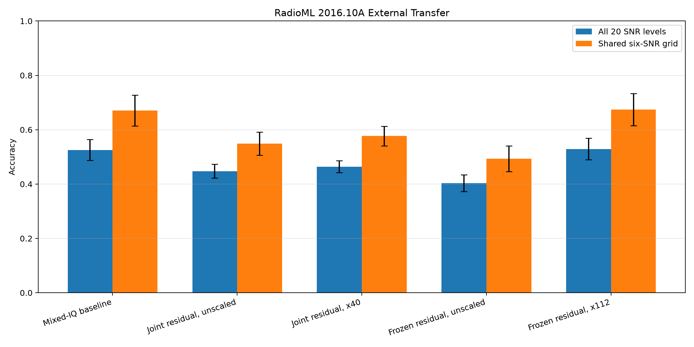

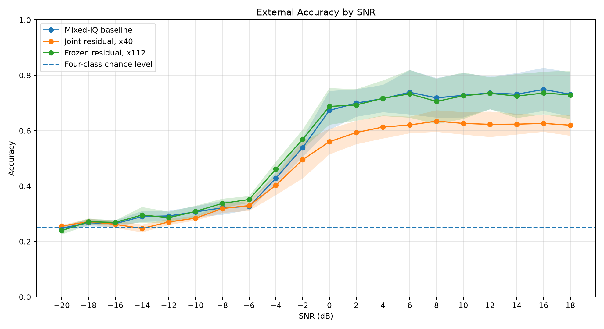

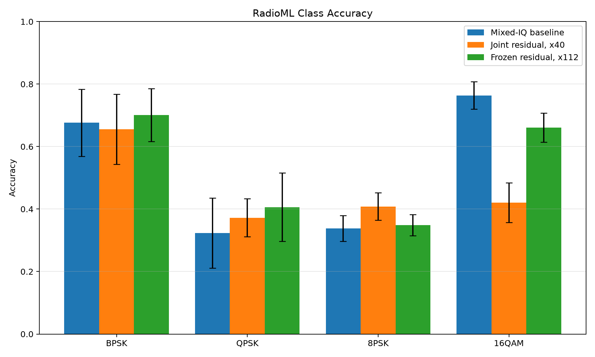

Detailed conversion methodology, matched short-window controls, amplitude analysis, paired-seed comparisons, limitations, and model-selection decisions are documented in [RadioML 2016.10A External Transfer Evaluation v1](reports/radioml2016_external_transfer_v1.md).

## Self-Supervised Label Efficiency

The label-efficiency study compares random initialization, SimCLR, and VICReg using the same compact GroupNorm CNN and paired class/SNR-stratified labeled subsets.

Every downstream run uses an exact budget of `1,320` optimizer updates. The complete matrix contains:

- Five labeled-data fractions: 1%, 5%, 10%, 25%, and 100%
- Three initialization methods: random, SimCLR, and VICReg
- Five paired downstream seeds: `2026` through `2030`
- 75 supervised training runs
- 300 held-out evaluations across clean, mild, moderate, and severe channel conditions

### Selected SSL Systems

| Intended use | Labels | Initialization | Validation | Clean | Mild | Moderate | Severe | Four-condition macro |
|---|---:|---|---:|---:|---:|---:|---:|---:|
| Clean low-label specialist | 1% | SimCLR | **76.66%** | **75.76%** | 68.10% | 51.39% | 34.80% | 57.51% |
| Label-efficient compromise | 5% | VICReg | **93.04%** | **92.24%** | **83.43%** | **63.03%** | 38.39% | **69.27%** |
| Robust low-label model | 10% | VICReg | **94.24%** | 93.64% | **84.50%** | **62.41%** | **37.51%** | **69.52%** |
| Full-label model | 100% | Random initialization | **95.64%** | **95.29%** | **86.81%** | **65.26%** | **39.21%** | **71.64%** |

The main conclusions are:

- SimCLR gives the largest clean-channel improvement in the extreme 1% label regime: `+1.67` percentage points on clean held-out data.
- The same 1% SimCLR model degrades moderate and severe multipath performance, so it is treated as a clean-channel specialist rather than a robust default.
- VICReg at 5% labels provides the most balanced low-label compromise, improving the clean, mild, and moderate conditions and increasing the four-condition macro average on four of five paired seeds.
- VICReg at 10% labels provides the strongest robustness-oriented SSL result: `+0.86`, `+1.73`, and `+0.69` percentage points on mild, moderate, and severe multipath, respectively, with only a `0.23`-point clean-data trade-off.
- With all labels available, random initialization remains best. Neither SSL method provides a consistent full-label advantage.

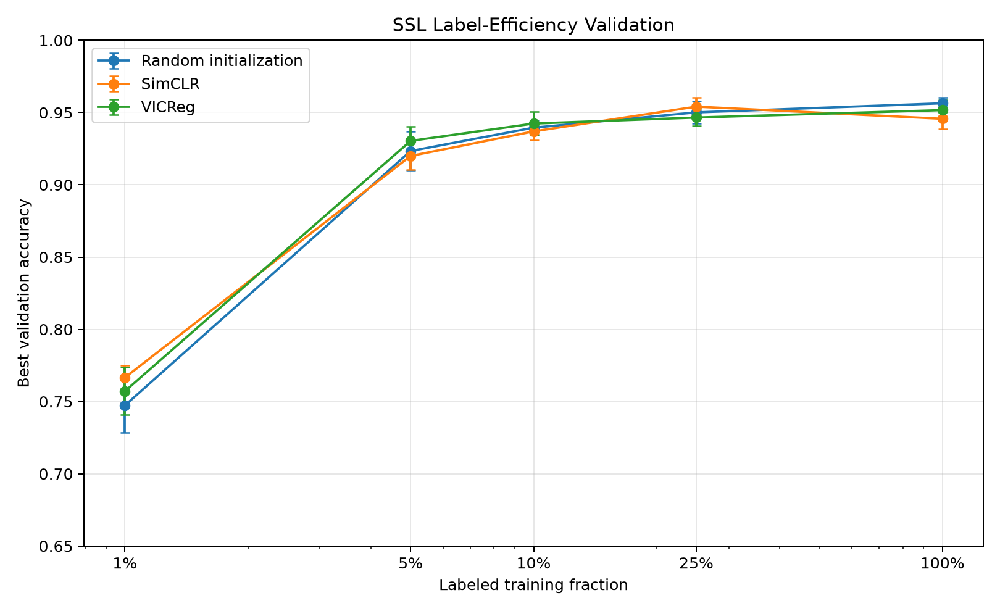

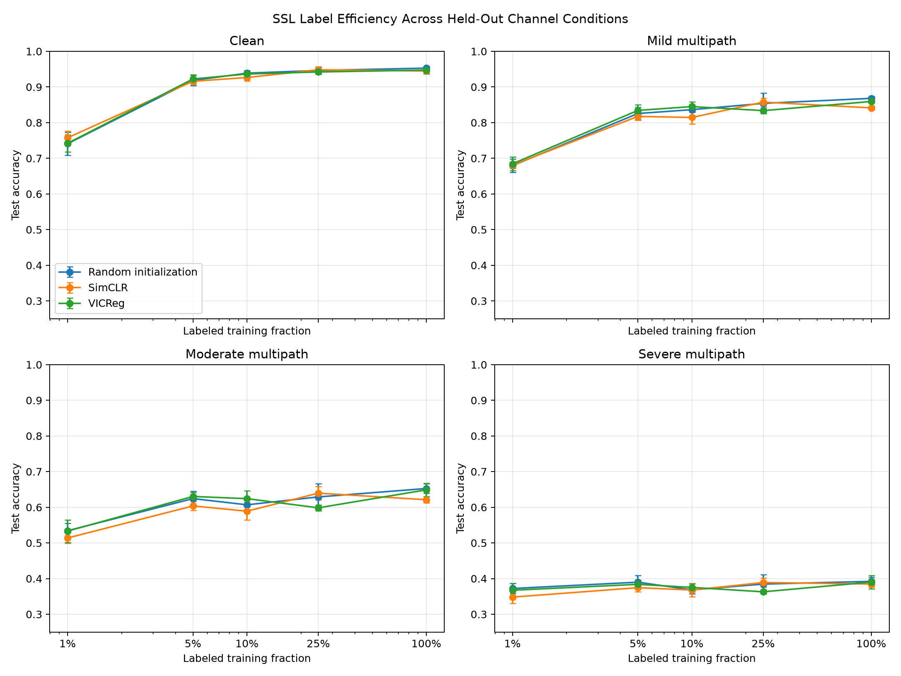

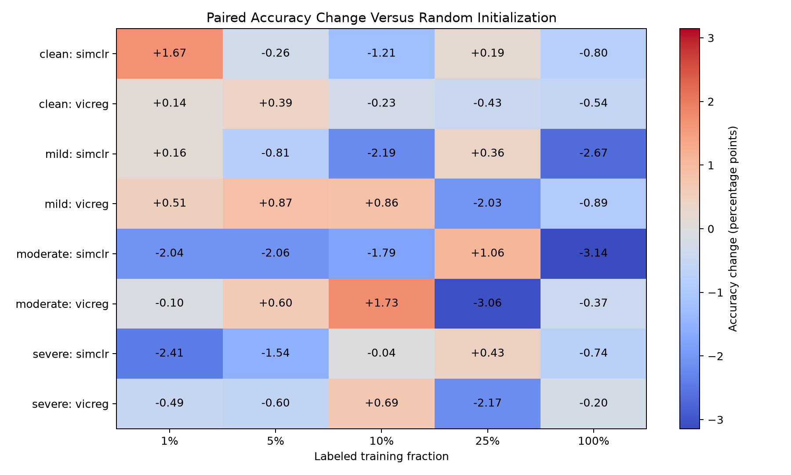

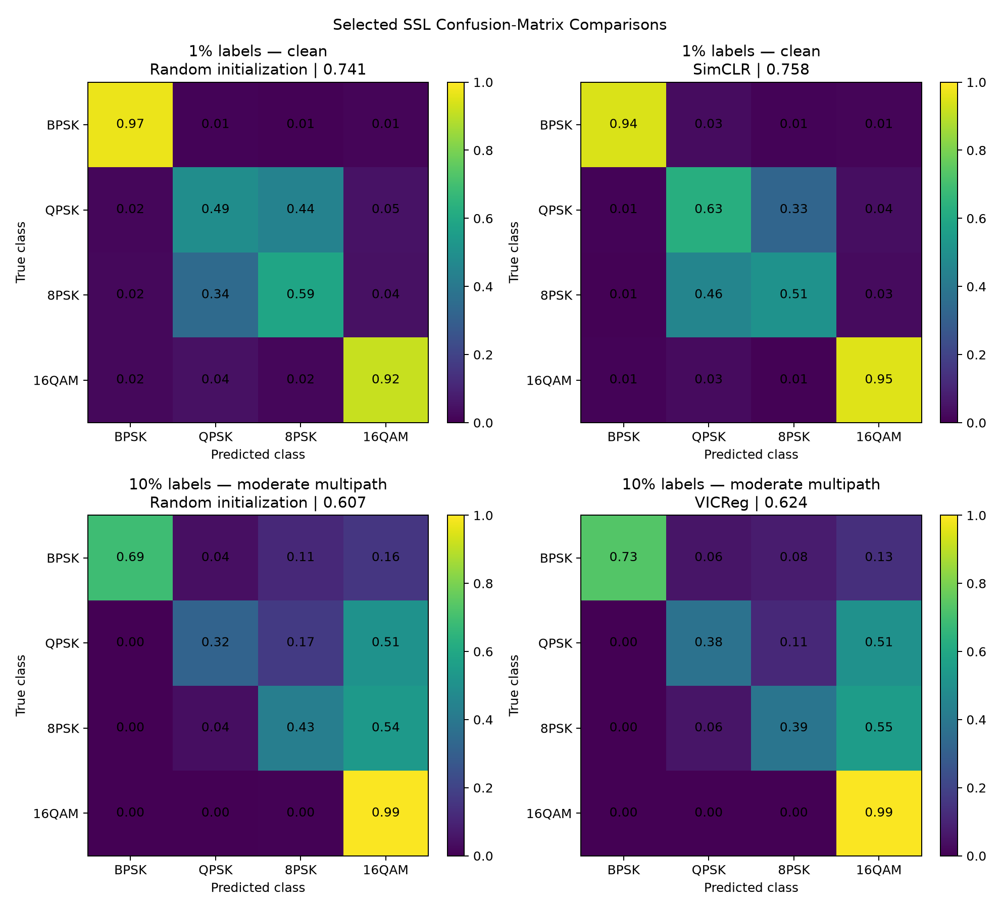

Detailed protocol, paired validation results, held-out channel evaluation, pooled confusion matrices, selected systems, limitations, and reproduction commands are documented in [SSL Label-Efficiency Evaluation v2](reports/ssl_label_efficiency_v2.md).

## Confidence Calibration Under Channel Shift

The calibration milestone tests whether one scalar temperature fitted on the clean validation split remains reliable when the channel changes at inference time.

The completed matrix contains:

- 75 validation-fitted temperatures
- 75 validation calibration artifacts
- 300 held-out calibration artifacts
- Five labeled-data fractions
- Random, SimCLR, and VICReg initialization
- Five paired seeds
- Clean, mild, moderate, and severe held-out channel conditions
- NLL, ECE, MCE, Brier score, reliability-bin, and selective-accuracy analysis

Temperature scaling preserves argmax predictions, so classification accuracy remains unchanged in all 300 held-out evaluations.

### Average Transfer by Held-Out Condition

| Condition | Mean NLL change | Mean ECE change | Mean Brier change | NLL improved | ECE improved |
|---|---:|---:|---:|---:|---:|
| Clean | **-0.03001** | **-0.03100** | **-0.00837** | **71/75** | **71/75** |
| Mild multipath | +0.16737 | +0.00916 | +0.00056 | 16/75 | 16/75 |
| Moderate multipath | +0.92714 | +0.02241 | +0.01541 | 16/75 | 16/75 |
| Severe multipath | +2.31736 | +0.01144 | +0.01760 | 16/75 | 16/75 |

Negative changes are improvements for NLL, ECE, and Brier score.

The central result is:

> **Validation-fitted scalar temperature scaling improves in-distribution calibration but does not transfer reliably to multipath channel shift.**

The 1% label regime is the main exception. It improves NLL and ECE in 56 of 60 evaluations because these low-label models generally benefit from softened probabilities. From 5% labels upward, clean validation often selects temperatures below 1.0, sharpening predictions and amplifying overconfidence under multipath.

Selective-accuracy changes remain very small and slightly negative on average. Scalar temperature scaling changes probability magnitudes but does not create a meaningfully better ranking for confidence-based rejection.

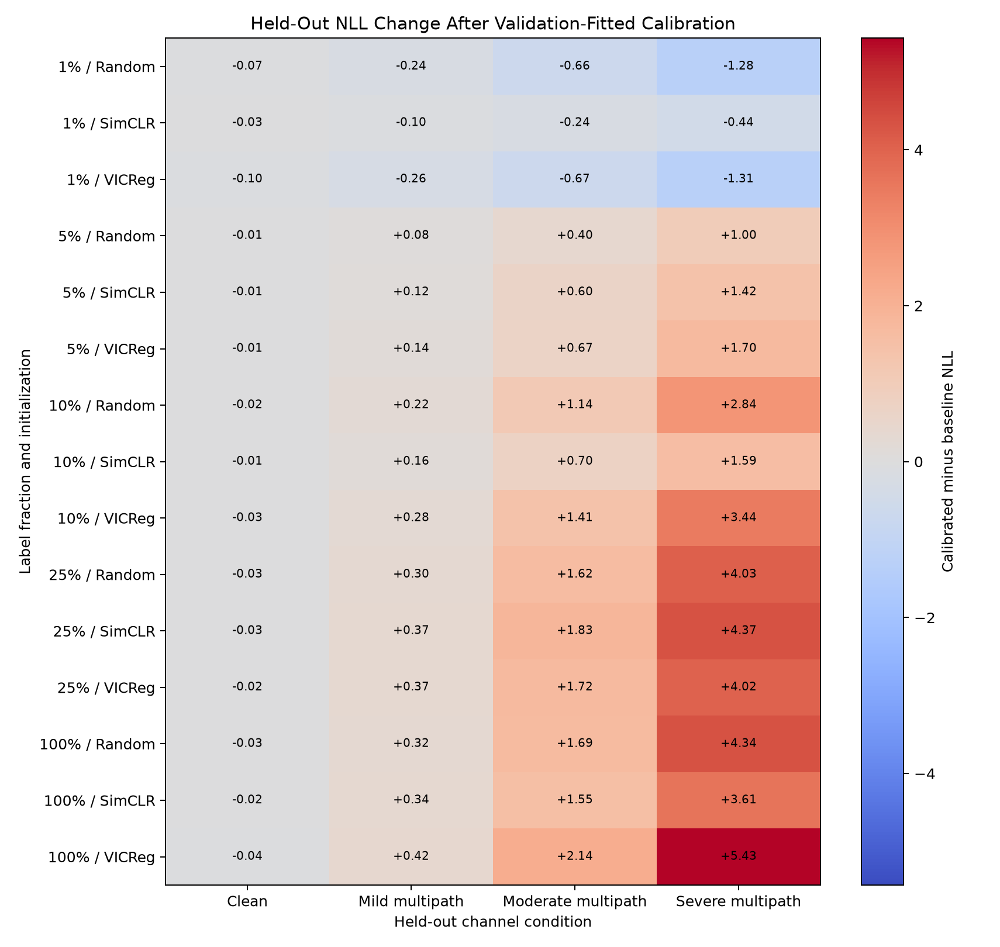

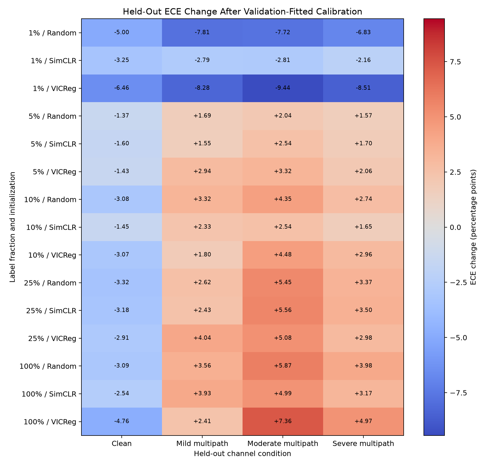

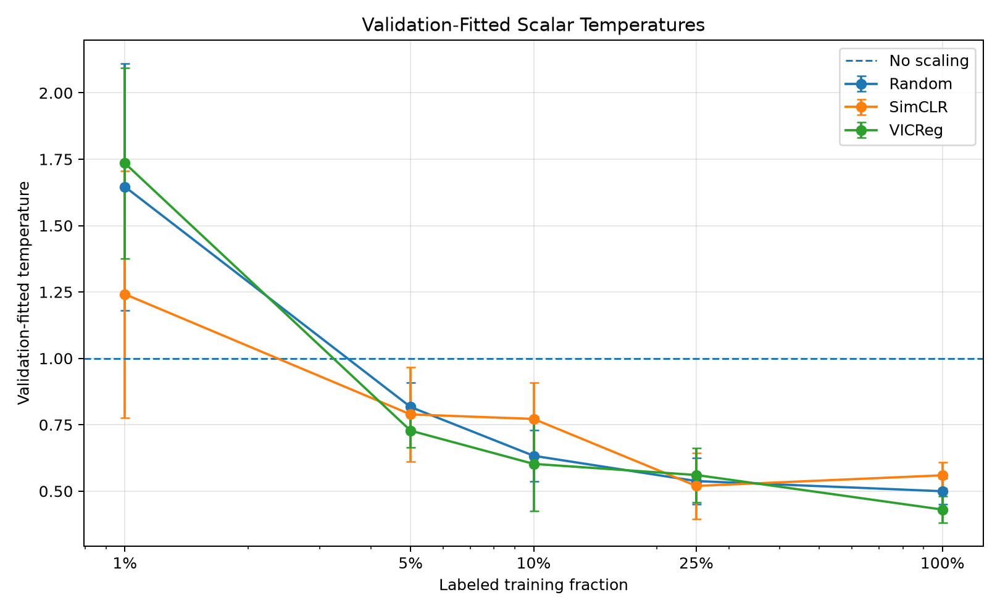

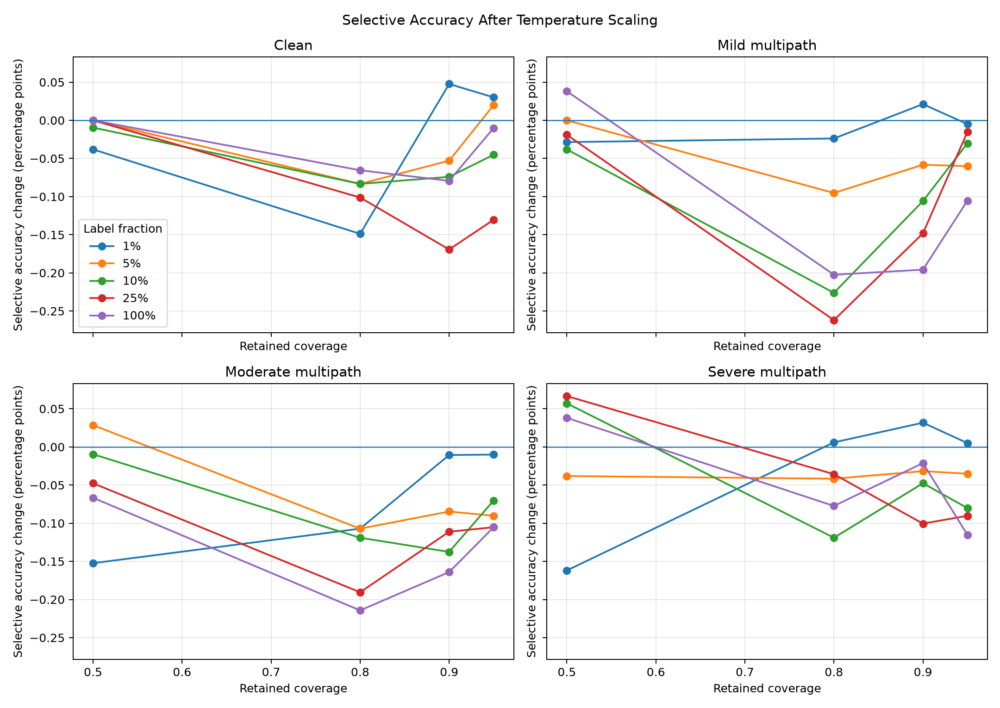

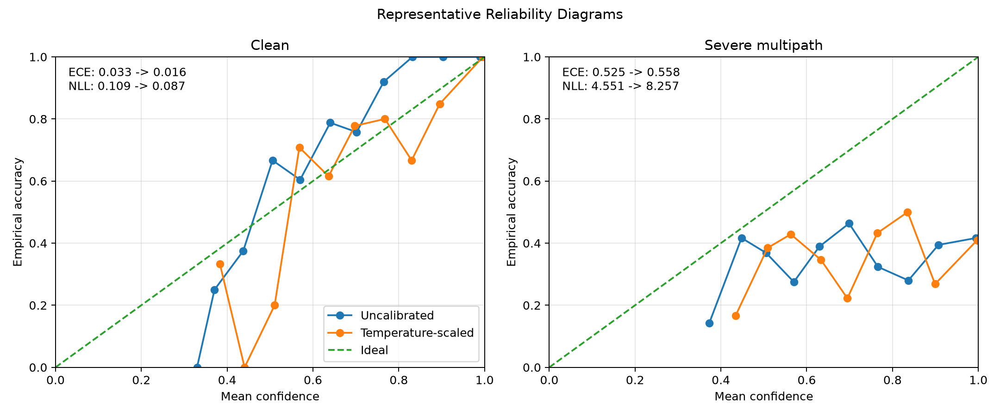

Complete methodology, artifact integrity checks, transfer results, reliability analysis, limitations, and deployment recommendations are documented in [SSL Confidence Calibration Under Channel Shift v1](reports/ssl_confidence_calibration_v1.md).

## Channel-Shift Detection from IQ Features

The channel-shift milestone asks whether a deployed classifier can recognize that its RF input distribution has moved from the clean channel to frequency-selective multipath.

The evaluation uses four row-aligned held-out datasets containing 1,400 examples each:

- Clean
- Mild multipath
- Moderate multipath
- Severe multipath

Labels, SNR values, frequency offsets, phase offsets, amplitude scales, timing shifts, fading flags, and example seeds are identical across conditions. A deterministic class/SNR-stratified split assigns 700 paired examples to development and 700 paired examples to untouched testing across 28 strata.

### Detector Systems

| System | Input | Selection protocol |
|---|---|---|
| Lag-8 autocorrelation | One IQ feature | Direction selected on pooled development data |
| All-IQ linear | 21 deterministic IQ features | Standardization and L2 selected with grouped development-only cross-validation |
| Output energy | Checkpoint logits | Direction selected on pooled development data for each checkpoint |
| IQ + energy fusion | 21 IQ features plus checkpoint energy | Standardization and L2 selected with grouped development-only cross-validation |

The grouped folds keep every clean/shifted version of one `example_seed` in the same fold. Test examples are not used for feature direction, regularization selection, standardization, or coefficient fitting.

### Aggregate Results Across 75 Checkpoints

| Condition | System | Mean AUROC | Mean AP | Mean FPR@95TPR |
|---|---|---:|---:|---:|
| Mild | Lag-8 autocorrelation | 0.8019 | 0.8337 | 0.7529 |
| Mild | **All-IQ linear** | **0.8312** | **0.8619** | 0.7671 |
| Mild | Output energy | 0.5275 | 0.5293 | 0.9156 |
| Mild | IQ + energy fusion | 0.8281 | 0.8573 | **0.7366** |
| Moderate | Lag-8 autocorrelation | 0.9314 | 0.9486 | 0.4157 |
| Moderate | All-IQ linear | 0.9512 | 0.9614 | **0.3129** |
| Moderate | Output energy | 0.5328 | 0.5533 | 0.9052 |
| Moderate | **IQ + energy fusion** | **0.9521** | **0.9621** | 0.3173 |
| Severe | Lag-8 autocorrelation | 0.9497 | 0.9614 | 0.3800 |
| Severe | All-IQ linear | 0.9794 | **0.9829** | 0.1229 |
| Severe | Output energy | 0.4843 | 0.5236 | 0.9275 |
| Severe | **IQ + energy fusion** | **0.9798** | 0.9828 | **0.1200** |

Across the three shifted conditions, the all-IQ detector reaches a mean AUROC of **0.9206**. The fusion detector reaches **0.9200** mean AUROC and the best mean FPR@95TPR, **0.3913** versus **0.4010** for all-IQ.

The primary selection is:

> **Use the all-IQ linear detector as the default channel-shift detector. Retain IQ-plus-energy fusion as an optional operating-point variant when a modest FPR95 reduction is more important than maximum mean AUROC.**

Output energy alone is not suitable for deployment shift detection. Its direction changes with severity: mild and moderate multipath move mean energy upward relative to clean, while severe multipath moves it downward. The IQ features remain robust because they measure the signal geometry and temporal/spectral structure directly.

The remaining weakness is mild multipath. Even the best mild operating point has FPR@95TPR of 0.7366, so detecting 95% of mild shifts would still flag many clean windows.

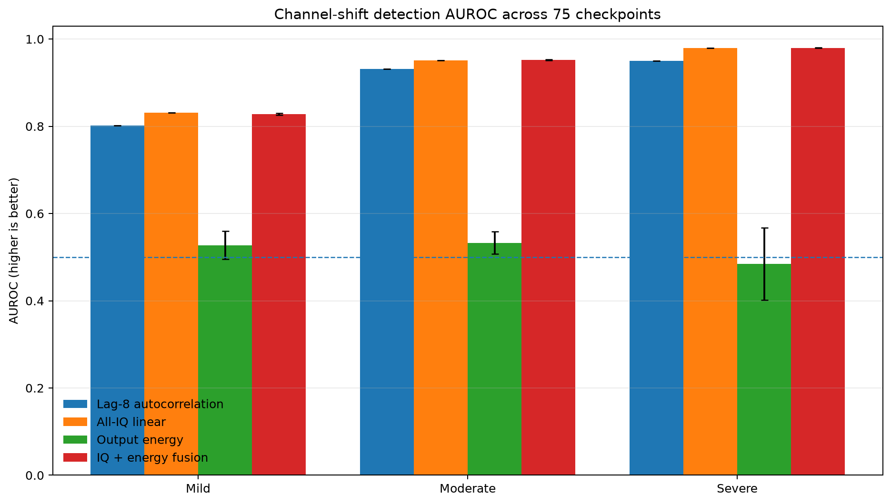

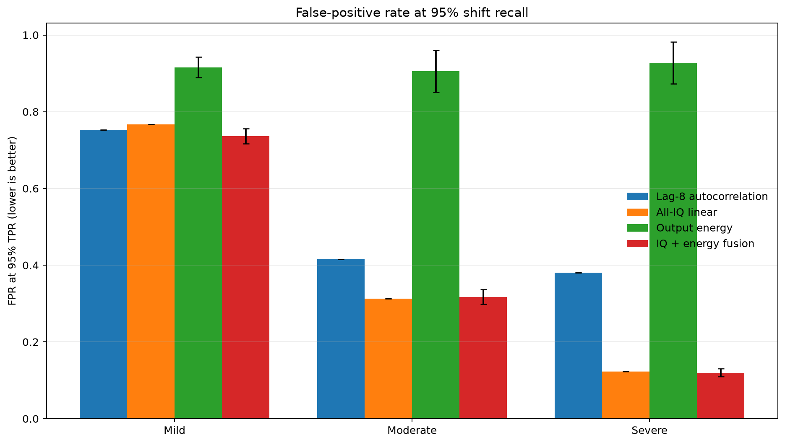

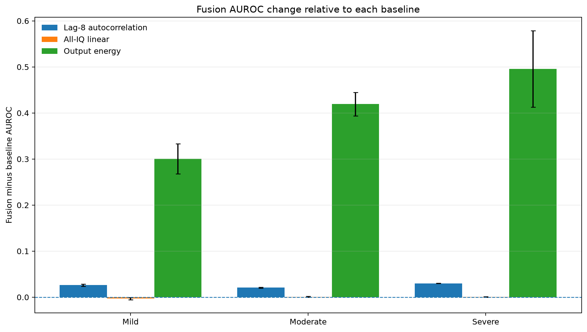

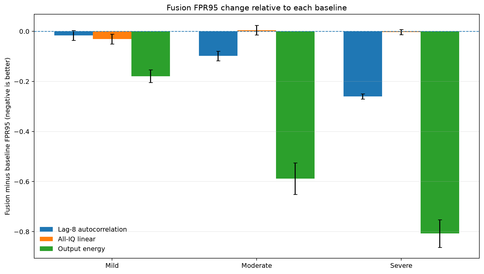

Complete feature definitions, leakage controls, development protocol, 900-comparison results, system selection, limitations, and reproduction commands are documented in [Channel-Shift Detection from IQ Features v1](reports/channel_shift_detection_v1.md).

## Deployment and IQ Inference

The deployment milestone turns the selected PyTorch checkpoints into reusable local inference components for fixed windows, long recordings, and streaming IQ data.

### Supported Workflows

- Strict checkpoint reconstruction with model-configuration and class-order validation
- CPU, CUDA, and automatic device selection
- Single-window and batched prediction
- `.npy` and `.npz` input loading
- Complex IQ vectors and real `[2, samples]` tensors
- Dataset sample selection with optional labels and SNR metadata
- Full logits, probabilities, confidence, and top-k rankings
- Machine-readable JSON output
- Sliding-window long-signal inference
- Configurable stride, overlap, padding, dropping, and exact-length enforcement
- Valid-sample-weighted signal-level aggregation
- Fixed-memory streaming buffers
- Configurable streaming hop size and chunk size
- Absolute sample positions and optional timestamps
- Fresh-process CPU and CUDA benchmarks

### Fresh-Process Benchmark Results

The benchmark uses the validation-selected full-label random-initialization checkpoint, 2,048-sample IQ windows, 30 warm-up iterations, and 200 measured iterations per case.

| Device | Batch | Mean latency | P95 latency | Throughput | Peak CUDA memory |
|---|---:|---:|---:|---:|---:|
| CPU | 1 | 1.32 ms | 1.65 ms | 759.6 windows/s | — |
| CPU | 32 | 14.09 ms | 15.56 ms | **2,270.7 windows/s** | — |
| CUDA | 1 | **1.10 ms** | **1.45 ms** | 910.5 windows/s | 10.4 MiB |
| CUDA | 32 | 1.54 ms | 2.05 ms | 20,715.3 windows/s | 33.9 MiB |
| CUDA | 128 | 2.35 ms | 3.12 ms | **54,501.9 windows/s** | 107.4 MiB |

Key deployment conclusions:

- CPU is suitable for low-volume interactive requests and low-rate single streams.
- CPU throughput peaks at 2,270.7 windows per second with batch size 32.
- CUDA becomes clearly advantageous once independent windows can be batched.
- CUDA reaches 54,501.9 windows per second with batch size 128.
- At batch size 128, CUDA provides a 26.82× throughput improvement over CPU.
- CUDA batch-one steady-state latency is 1.10 ms, but the first CUDA inference takes approximately 185–225 ms because of one-time runtime and kernel initialization.
- Production CUDA deployment should use a persistent, warmed process rather than launching a new process for every prediction.


Architecture, input contracts, command-line workflows, streaming behavior, benchmark protocol, complete results, limitations, and deployment recommendations are documented in [Deployment and IQ Inference Evaluation v1](reports/deployment_inference_v1.md).

## Why the Frozen Head Refit Was Selected

The earlier GroupNorm baseline achieved:

```text
95.29% ± 0.45 percentage points
```

The frozen linear-head refit improved the five-seed held-out result to:

```text
96.50% ± 0.26 percentage points
```

Compared with the original GroupNorm classifier head, the refit:

- Increased mean validation accuracy by 0.61 percentage points
- Improved validation accuracy for all five seeds
- Increased mean held-out test accuracy by 1.21 percentage points
- Improved held-out test accuracy for all five seeds
- Reduced test standard deviation by 0.19 percentage points
- Increased the minimum test accuracy by 1.43 percentage points
- Increased mean QPSK accuracy by 0.91 percentage points
- Increased mean 8PSK accuracy by 4.00 percentage points
- Increased mean accuracy at -4 dB by 3.50 percentage points
- Increased mean accuracy at 0 dB by 3.70 percentage points

The worst refitted test run, 96.14%, exceeded the best original GroupNorm run, 96.07%.

The refit does not change the CNN architecture or parameter count. It replaces only the final `Linear(128, 4)` decision boundary, and the saved checkpoint runs entirely in PyTorch.

## Signal and Dataset Pipeline

Each synthetic classification example follows this pipeline:

1. Random modulation-symbol generation
2. Root-raised-cosine transmit pulse shaping
3. Fixed-length waveform extraction
4. Amplitude scaling
5. Optional flat Rayleigh fading
6. Optional frequency-selective tapped-delay-line multipath
7. Carrier frequency offset
8. Carrier phase offset
9. Zero-padded integer timing shift
10. AWGN at the configured SNR
11. Conversion to a two-channel tensor

The model input format is:

```text
[batch, 2, samples]
```

- Channel 0: in-phase component
- Channel 1: quadrature component
- Default baseline sample length: 2,048 samples

The generated dataset stores labels and impairment metadata, including SNR, frequency offset, phase offset, amplitude scale, timing shift, fading state, multipath condition, and generation seed.

## Selected Clean-Channel Model

The selected clean-channel system is a compact one-dimensional CNN encoder with GroupNorm and a validation-selected linear classifier head.

```text
Input: [batch, 2, 2048]

Conv block: 2 → 32
Conv block: 32 → 64
Conv block: 64 → 128
Adaptive global average pooling
128-dimensional embedding
Dropout
Linear classifier: 128 → 4
```

Each convolutional block contains:

- `Conv1d`
- GroupNorm with 8 groups
- GELU activation
- Max pooling

Trainable parameters:

```text
73,092
```

The frozen-head procedure keeps the trained CNN encoder fixed, extracts the pooled 128-dimensional embedding, fits a standardized multinomial logistic-regression classifier on training embeddings, selects regularization using validation accuracy, converts the selected classifier into raw-feature PyTorch weights, and writes those weights into the existing final linear layer.

RMS input normalization remains implemented as an optional checkpointed setting, but it is disabled in the selected model because the five-seed ablation reduced mean test accuracy and increased variance.

## Frozen Head Refit Protocol

For every seed:

1. Train the GroupNorm CNN using the normal 30-epoch training pipeline.
2. Select the checkpoint with the highest validation accuracy.
3. Freeze the CNN encoder.
4. Extract training and validation embeddings with `model.extract_features(iq)`.
5. Fit `StandardScaler + LogisticRegression` candidates using only training embeddings.
6. Select the regularization value `C` using validation accuracy.
7. Break validation ties in favor of the smaller `C`, corresponding to stronger regularization.
8. Convert the standardized classifier to equivalent raw-embedding parameters.
9. Replace the checkpoint's final PyTorch linear layer.
10. Evaluate the resulting native checkpoint once on the held-out test split.

Candidate regularization values:

```text
0.01, 0.03, 0.1, 0.3, 1.0, 3.0, 10.0
```

Selected values:

| Seed | Selected C |
|---:|---:|
| 2026 | 1.0 |
| 2027 | 10.0 |
| 2028 | 0.1 |
| 2029 | 3.0 |
| 2030 | 1.0 |

For standardized embeddings

```text
z = (x - mean) / scale
```

the equivalent raw-feature linear layer is:

```text
W_raw = W_standardized / scale
b_raw = b_standardized - W_raw @ mean
```

This conversion allows the refitted classifier to be stored and deployed as a normal PyTorch checkpoint without requiring scikit-learn during inference.

## Reproducibility Findings

### GroupNorm Encoder Validation Performance

Best-checkpoint validation accuracy before head refitting:

```text
95.64% ± 0.40 percentage points
```

Final-epoch validation accuracy before head refitting:

```text
94.10% ± 2.34 percentage points
```

### Validation-Selected Head Refit

Validation accuracy after independently refitting each seed:

```text
96.26% ± 0.21 percentage points
```

| Seed | Original validation | Refitted validation | Change |
|---:|---:|---:|---:|
| 2026 | 96.43% | 96.64% | +0.21 pp |
| 2027 | 95.50% | 96.29% | +0.79 pp |
| 2028 | 95.43% | 96.14% | +0.71 pp |
| 2029 | 95.29% | 96.14% | +0.86 pp |
| 2030 | 95.57% | 96.07% | +0.50 pp |

Every seed improved on validation, and validation variation decreased.

### BatchNorm Comparison

The earlier BatchNorm model produced:

```text
Best validation: 94.17% ± 0.31 percentage points
Final validation: 88.39% ± 4.13 percentage points
Held-out test: 94.24% ± 0.29 percentage points
```

GroupNorm substantially improved late-training behavior and reduced dependence on unstable BatchNorm running statistics. The frozen-head refit then improved the learned decision boundary without modifying the encoder.

## RMS Normalization Ablation

Per-example complex RMS normalization was tested without changing the dataset, architecture, optimizer, batch size, epoch count, or seeds.

Its single-seed result looked promising, but the five-seed result was worse:

| Metric | BatchNorm baseline | RMS-normalized |
|---|---:|---:|
| Mean test accuracy | 94.24% | 93.93% |
| Test standard deviation | 0.29 pp | 0.80 pp |
| Minimum test accuracy | 93.93% | 92.43% |
| Mean accuracy at -4 dB | 70.50% | 68.90% |

RMS normalization is therefore retained as an ablation and optional feature, not used as the default preprocessing path.

## Quick Start

### 1. Clone the repository

```powershell
git clone https://github.com/AdnanTawkul/rf-signal-intelligence-lab.git
cd rf-signal-intelligence-lab
```

### 2. Create and activate the virtual environment

```powershell
py -3.12 -m venv .venv
.\.venv\Scripts\Activate.ps1
```

### 3. Upgrade packaging tools

```powershell
python -m pip install --upgrade pip setuptools wheel
```

### 4. Install PyTorch with CUDA support

The development environment uses the official PyTorch CUDA 12.8 wheel channel:

```powershell
python -m pip install torch --index-url https://download.pytorch.org/whl/cu128
```

### 5. Install project dependencies

```powershell
python -m pip install -r requirements.txt
```

### 6. Verify the GPU

```powershell
python -c "import torch; print(torch.__version__); print(torch.cuda.is_available()); print(torch.cuda.get_device_name(0) if torch.cuda.is_available() else 'NO CUDA DEVICE')"
```

Expected hardware in the original development environment:

```text
NVIDIA GeForce RTX 4080 SUPER
```

## Reproduce the Selected Baseline

### Generate the baseline dataset

```powershell
python scripts\generate_dataset.py --config configs\dataset_baseline_v1.yaml
```

Expected split sizes:

| Split | Examples |
|---|---:|
| Train | 5,600 |
| Validation | 1,400 |
| Test | 1,400 |

Generated datasets are stored under `data/processed/` and are intentionally excluded from Git.

### Run the five-seed GroupNorm training study

```powershell
python scripts\run_baseline_seed_sweep.py --config configs\baseline_groupnorm_seed_sweep_v1.yaml
```

### Refit all five classifier heads

```powershell
python scripts\run_frozen_head_refit_seed_sweep.py --config configs\refit_groupnorm_head_seed_sweep_v1.yaml
```

### Evaluate all five native refitted checkpoints

```powershell
python scripts\evaluate_seed_sweep.py --config configs\evaluate_groupnorm_head_refit_seed_sweep_v1.yaml
```

### Refit and evaluate one checkpoint

```powershell
python scripts\refit_frozen_head.py --config configs\refit_groupnorm_head_v1.yaml
python scripts\evaluate_baseline.py --config configs\evaluate_groupnorm_head_refit_v1.yaml
python scripts\analyze_baseline_errors.py --config configs\analyze_groupnorm_head_refit_v1.yaml
```

## Reproduce the Multipath-Robust Models

The following commands assume that the clean and multipath datasets referenced by the configurations are available under `data/processed/`.

### Joint residual front end

Train all five seeds:

```powershell
python scripts\run_baseline_seed_sweep.py --config configs\baseline_groupnorm_residual_equalizer_seed_sweep_v1.yaml
```

Evaluate clean, mild, moderate, and severe conditions:

```powershell
$configs = @(
    "configs\evaluate_groupnorm_residual_equalizer_seed_sweep_v1.yaml",
    "configs\evaluate_groupnorm_residual_equalizer_mild_seed_sweep_v1.yaml",
    "configs\evaluate_groupnorm_residual_equalizer_moderate_seed_sweep_v1.yaml",
    "configs\evaluate_groupnorm_residual_equalizer_severe_seed_sweep_v1.yaml"
)

foreach ($config in $configs) {
    python scripts\evaluate_seed_sweep.py --config $config
}
```

Generate the consolidated comparison:

```powershell
python scripts\compare_multipath_mitigation.py --config configs\compare_residual_equalizer_v1.yaml
```

### Frozen-backbone residual front end

Train five paired front ends while loading and freezing the matching baseline checkpoint for each seed:

```powershell
python scripts\run_baseline_seed_sweep.py --config configs\baseline_groupnorm_frozen_backbone_equalizer_seed_sweep_v1.yaml
```

Evaluate all four channel conditions:

```powershell
$configs = @(
    "configs\evaluate_groupnorm_frozen_backbone_equalizer_seed_sweep_v1.yaml",
    "configs\evaluate_groupnorm_frozen_backbone_equalizer_mild_seed_sweep_v1.yaml",
    "configs\evaluate_groupnorm_frozen_backbone_equalizer_moderate_seed_sweep_v1.yaml",
    "configs\evaluate_groupnorm_frozen_backbone_equalizer_severe_seed_sweep_v1.yaml"
)

foreach ($config in $configs) {
    python scripts\evaluate_seed_sweep.py --config $config
}
```

Generate the consolidated frozen-backbone comparison:

```powershell
python scripts\compare_multipath_mitigation.py --config configs\compare_frozen_backbone_equalizer_v1.yaml
```


## Reproduce the RadioML External-Transfer Evaluation

The raw RadioML archive and generated NPZ datasets are excluded from Git.

### Convert the four-class RadioML subset

```powershell
python scripts\convert_radioml2016.py `
  --config configs\dataset_radioml2016_four_class_v1.yaml
```

### Run the unscaled five-seed evaluations

```powershell
$configs = @(
    "configs\evaluate_radioml2016_mixed_iq_baseline_seed_sweep_v1.yaml",
    "configs\evaluate_radioml2016_joint_residual_equalizer_seed_sweep_v1.yaml",
    "configs\evaluate_radioml2016_frozen_backbone_equalizer_seed_sweep_v1.yaml"
)

foreach ($config in $configs) {
    python scripts\evaluate_seed_sweep.py --config $config
}
```

### Run the validation-selected scale diagnostics

```powershell
python scripts\evaluate_seed_sweep.py `
  --config configs\evaluate_radioml2016_joint_residual_equalizer_scaled_x40_seed_sweep_v1.yaml

python scripts\evaluate_seed_sweep.py `
  --config configs\evaluate_radioml2016_frozen_backbone_equalizer_scaled_x112_seed_sweep_v1.yaml
```

### Regenerate the consolidated analysis

```powershell
python scripts\analyze_radioml2016_external_transfer.py `
  --config configs\compare_radioml2016_external_transfer_v1.yaml
```

## Reproduce the SSL Label-Efficiency Study

Prepare and validate the exact-budget 75-run matrix:

```powershell
python scripts\run_ssl_label_efficiency_seed_sweep.py `
  --config configs\ssl_label_efficiency_seed_sweep_v2.yaml `
  --dry-run
```

Execute or resume downstream training:

```powershell
python scripts\execute_ssl_label_efficiency_seed_sweep.py `
  --manifest results\ssl_label_efficiency_seed_sweep_v2\dry_run_manifest.json `
  --resume
```

Evaluate all 75 checkpoints on clean, mild, moderate, and severe held-out data:

```powershell
python scripts\evaluate_ssl_label_efficiency.py `
  --config configs\evaluate_ssl_label_efficiency_v2.yaml `
  --resume
```

Regenerate the selected-system summary and figures:

```powershell
python scripts\analyze_ssl_label_efficiency.py `
  --config configs\analyze_ssl_label_efficiency_v2.yaml
```

## Reproduce the Confidence-Calibration Study

Export validation logits and fit one scalar temperature per checkpoint:

```powershell
python scripts\fit_ssl_validation_temperatures.py `
  --config configs\fit_ssl_validation_temperatures_v1.yaml
```

Backfill calibration-ready held-out prediction artifacts:

```powershell
python scripts\backfill_ssl_calibration_predictions.py `
  --config configs\backfill_ssl_calibration_predictions_v1.yaml
```

Apply the frozen validation temperatures to all held-out conditions and aggregate the metrics:

```powershell
python scripts\analyze_ssl_calibration.py `
  --config configs\analyze_ssl_calibration_v1.yaml
```

Regenerate the calibration figures and compact visualization summary:

```powershell
python scripts\visualize_ssl_calibration.py `
  --config configs\visualize_ssl_calibration_v1.yaml
```

## Reproduce the Channel-Shift Detection Study

The following commands assume that the paired clean and multipath test datasets and the 300 calibration-prediction artifacts are available locally.

Extract and validate the 21 deterministic IQ features:

```powershell
python scripts\extract_iq_channel_features.py `
  --config configs\extract_iq_channel_features_v1.yaml
```

Evaluate every feature individually with development-only direction selection:

```powershell
python scripts\analyze_iq_feature_shift_detection.py `
  --config configs\analyze_iq_feature_shift_detection_v1.yaml
```

Fit the grouped-cross-validation all-IQ linear detector:

```powershell
python scripts\analyze_linear_iq_shift_detection.py `
  --config configs\analyze_linear_iq_shift_detection_v1.yaml
```

Regenerate the output-only uncertainty baseline:

```powershell
python scripts\analyze_output_channel_shift.py `
  --config configs\analyze_output_channel_shift_v1.yaml
```

Run the 75-checkpoint, four-system comparison:

```powershell
python scripts\compare_channel_shift_detectors.py `
  --config configs\compare_channel_shift_detectors_v1.yaml
```

Regenerate the publication-ready figures:

```powershell
python scripts\visualize_channel_shift_detectors.py `
  --config configs\visualize_channel_shift_detectors_v1.yaml
```

## Run Deployment Inference

The following examples use a compatible trained checkpoint. Replace the checkpoint and input paths as required.

### Fixed-window prediction

```powershell
python scripts\predict_iq.py `
  --checkpoint results\ssl_label_efficiency_seed_sweep_v2\labels_100pct\random\seed_2026\best_model.pt `
  --input data\processed\rf_modulation_baseline_v1\test.npz `
  --sample-index 0 `
  --device auto `
  --expected-samples 2048 `
  --top-k 4 `
  --output results\deployment_inference_v1\sample_prediction.json
```

### Long-signal sliding-window prediction

```powershell
python scripts\predict_long_iq.py `
  --checkpoint results\ssl_label_efficiency_seed_sweep_v2\labels_100pct\random\seed_2026\best_model.pt `
  --input path\to\long_signal.npy `
  --device auto `
  --window-size 2048 `
  --stride 1024 `
  --remainder pad `
  --batch-size 32 `
  --top-k 4 `
  --output results\deployment_inference_v1\long_prediction.json
```

### File-backed streaming simulation

```powershell
python scripts\stream_iq.py `
  --checkpoint results\ssl_label_efficiency_seed_sweep_v2\labels_100pct\random\seed_2026\best_model.pt `
  --input path\to\long_signal.npy `
  --device auto `
  --window-size 2048 `
  --hop-size 1024 `
  --chunk-size 256 `
  --sample-rate-hz 1000000 `
  --output results\deployment_inference_v1\stream_prediction.json
```

### Run one benchmark matrix

```powershell
python scripts\benchmark_inference.py `
  --checkpoint results\ssl_label_efficiency_seed_sweep_v2\labels_100pct\random\seed_2026\best_model.pt `
  --input data\processed\rf_modulation_baseline_v1\test.npz `
  --device cpu `
  --device cuda `
  --batch-size 1 `
  --batch-size 8 `
  --batch-size 32 `
  --batch-size 128 `
  --expected-samples 2048 `
  --warmup-iterations 30 `
  --measurement-iterations 200 `
  --output results\deployment_benchmark_v1\benchmark.json
```

### Regenerate benchmark analysis and figures

```powershell
python scripts\analyze_deployment_benchmark.py `
  --input-directory results\deployment_benchmark_v1\full_cases
```

## Reproduce Historical Ablations

### Original BatchNorm five-seed study

```powershell
python scripts\run_baseline_seed_sweep.py --config configs\baseline_seed_sweep_v1.yaml
python scripts\evaluate_seed_sweep.py --config configs\evaluate_seed_sweep_v1.yaml
```

### RMS-normalized five-seed study

```powershell
python scripts\run_baseline_seed_sweep.py --config configs\baseline_rms_seed_sweep_v1.yaml
python scripts\evaluate_seed_sweep.py --config configs\evaluate_rms_seed_sweep_v1.yaml
```

### Original GroupNorm five-seed study

```powershell
python scripts\run_baseline_seed_sweep.py --config configs\baseline_groupnorm_seed_sweep_v1.yaml
python scripts\evaluate_seed_sweep.py --config configs\evaluate_groupnorm_seed_sweep_v1.yaml
```

## Quality Checks

Run the complete test suite with warnings treated as errors:

```powershell
python -m pytest -W error
```

Run static analysis:

```powershell
python -m ruff check src tests scripts
```

Check whitespace and patch integrity:

```powershell
git diff --check
```

At the current milestone, the repository contains **1,051 passing tests**.

## Repository Structure

```text
rf-signal-intelligence-lab/
├── README.md
├── requirements.txt
├── pyproject.toml
├── .gitignore
├── LICENSE
├── configs/
├── data/
│   ├── raw/
│   ├── processed/
│   └── README.md
├── notebooks/
├── scripts/
├── src/
│   └── rfsil/
│       ├── data/
│       ├── dsp/
│       ├── models/
│       ├── ssl/
│       ├── training/
│       ├── evaluation/
│       ├── deployment/
│       └── demo/
├── tests/
├── reports/
│   └── figures/
└── results/
```

## Environment

The original development environment uses:

- Windows
- PowerShell
- Python 3.12
- PyTorch 2.11.0 with CUDA 12.8
- NVIDIA RTX 4080 SUPER
- 64 GB RAM
- PyCharm
- Git
- GitHub Desktop

The project runs locally. It does not require cloud services, paid APIs, or the OpenAI API.

## Safety Scope

This project is limited to synthetic and public-dataset RF signal analysis for education, research, and portfolio development.

It does not include:

- Jamming
- Evasion
- Targeting
- Weapon guidance
- Operational military procedures
- Instructions for disrupting communication systems

## Known Limitations

- The project now includes external validation on RadioML 2016.10A, but RadioML is itself a synthetic generator benchmark rather than over-the-air captured data.
- Real receiver effects and hardware-specific distortions are not yet represented fully.
- RadioML windows contain 128 samples, while the original models were trained on 2,048-sample windows.
- The validation-selected input-scale experiments are post-hoc diagnostics rather than untouched confirmatory evaluations.
- Low-SNR and severe-multipath PSK discrimination remain the dominant failure regimes.
- Residual front ends reduce, but do not eliminate, QPSK/8PSK confusion and PSK-to-16QAM collapse under severe multipath.
- The learned front-end transformations are not established physical channel inverses.
- Scalar temperature scaling is implemented, but clean-validation calibration does not transfer reliably to multipath channel shift.
- The same validation split is used for checkpoint selection and temperature fitting; a separate calibration split would provide a cleaner statistical protocol.
- ECE and MCE depend on binning and can be unstable in sparsely populated bins; NLL and Brier score are treated as the primary proper scoring rules.
- Model-output uncertainty is not a reliable multipath detector; even output energy remains near chance and reverses direction under severe shift.
- The IQ detector is evaluated on paired synthetic channel variants. Transfer to unpaired distributions, different receivers, and over-the-air recordings is not yet established.
- Mild multipath remains difficult at high recall: the best observed mild FPR@95TPR is 0.7366.
- The current IQ feature definitions were validated on 2,048-sample windows; transfer across sample rates and window lengths still requires study.
- Channel-aware confidence calibration that conditions on detected shift is not yet implemented.
- Uncertainty estimation beyond scalar confidence calibration is not yet implemented.
- The SimCLR and VICReg downstream studies each reuse one fixed pretrained checkpoint, so SSL-pretraining variance is not yet measured.
- The SSL study uses five paired downstream seeds and should be interpreted through paired changes and consistency counts rather than broad statistical claims.
- Deployment benchmarking is complete on one local workstation, but the results are hardware-, driver-, operating-system-, and checkpoint-specific.
- The benchmark excludes file-reading, JSON-serialization, acquisition-device, and network-service overhead.
- The first CUDA inference has a substantial one-time initialization cost, so the reported steady-state results assume a persistent warmed process.
- ONNX, TensorRT, quantization, and mixed-precision deployment are not yet implemented.

## Roadmap

### Completed

- [x] Reproducible Windows and CUDA environment
- [x] Synthetic modulation generation
- [x] Signal impairment pipeline
- [x] Root-raised-cosine pulse shaping
- [x] IQ, constellation, waveform, and spectrogram visualizations
- [x] Balanced dataset generation
- [x] PyTorch dataset loader
- [x] Baseline one-dimensional CNN
- [x] GPU training pipeline
- [x] Held-out evaluation
- [x] Confusion matrix
- [x] Accuracy-by-SNR analysis
- [x] Class-by-SNR error analysis
- [x] Five-seed reproducibility study
- [x] RMS-normalization ablation
- [x] BatchNorm versus GroupNorm ablation
- [x] GroupNorm baseline selection
- [x] GroupNorm 8PSK regression diagnosis
- [x] Public CNN embedding extraction interface
- [x] Frozen linear-head refit
- [x] Native PyTorch classifier-head conversion
- [x] Five-seed frozen-head reproducibility study
- [x] Frequency-selective multipath channel profiles
- [x] Balanced mixed-multipath supervised training
- [x] Paired clean, mild, moderate, and severe evaluation
- [x] Joint learnable residual signal front end
- [x] Frozen-backbone parameter-efficient adaptation
- [x] Five-seed residual-front-end robustness studies
- [x] Correction-magnitude and pooled-confusion analysis
- [x] Automated testing and Ruff checks
- [x] RadioML 2016.10A restricted loader and deterministic conversion
- [x] Four-class public-dataset train, validation, and test splits
- [x] Five-seed zero-shot external-transfer evaluation
- [x] Matched 128-sample synthetic control experiments
- [x] Validation-only input-scale diagnostics
- [x] Consolidated external-transfer analysis and report
- [x] SimCLR and VICReg self-supervised pretraining
- [x] Exact-budget SSL label-efficiency sweep at five label fractions
- [x] Resumable 75-run downstream SSL training matrix
- [x] 300-evaluation held-out SSL channel study
- [x] Paired SSL-versus-random change analysis
- [x] Selected pooled SSL confusion matrices
- [x] SSL label-efficiency technical report
- [x] Strict checkpoint-backed inference engine
- [x] NPY and NPZ deployment IQ loader
- [x] Confidence and top-k JSON prediction CLI
- [x] Long-signal sliding-window inference
- [x] Valid-sample-weighted signal aggregation
- [x] Fixed-memory streaming IQ inference
- [x] Configurable streaming hop size and timestamps
- [x] Fresh-process CPU and CUDA benchmark matrix
- [x] Latency, throughput, and CUDA-memory analysis
- [x] Deployment benchmark figures
- [x] Deployment and IQ inference technical report
- [x] Deployment milestone README finalization
- [x] Calibration-ready logit and probability artifacts
- [x] Validation-fitted scalar temperature scaling
- [x] 300-evaluation held-out calibration transfer study
- [x] Reliability diagrams and selective-accuracy analysis
- [x] Confidence-calibration technical report
- [x] Output-only channel-shift uncertainty baseline across 75 checkpoints
- [x] Deterministic 21-feature IQ channel representation
- [x] Versioned paired IQ-feature artifacts
- [x] Class/SNR-stratified paired development-test split
- [x] Individual IQ-feature shift-detection study
- [x] Grouped-CV all-IQ linear shift detector
- [x] 75-checkpoint lag-8, all-IQ, energy, and fusion comparison
- [x] Channel-shift detector figures and technical report

### Next

- [ ] Low-SNR-aware training experiments
- [ ] Channel-aware calibration
- [ ] Uncertainty estimation
- [ ] ONNX export
- [ ] Mixed-precision inference
- [ ] Quantization experiments
- [ ] Persistent local inference service
- [ ] Streamlit demo
- [ ] Over-the-air receiver-data evaluation
- [ ] Final project-wide technical report

## License

This project is licensed under the MIT License.
