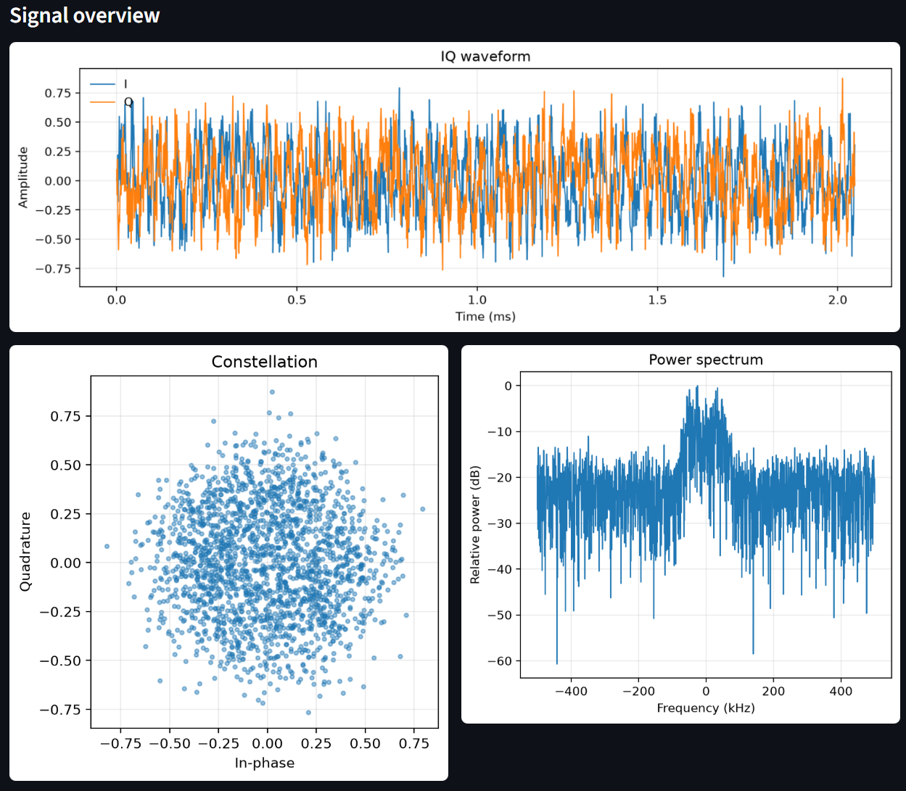
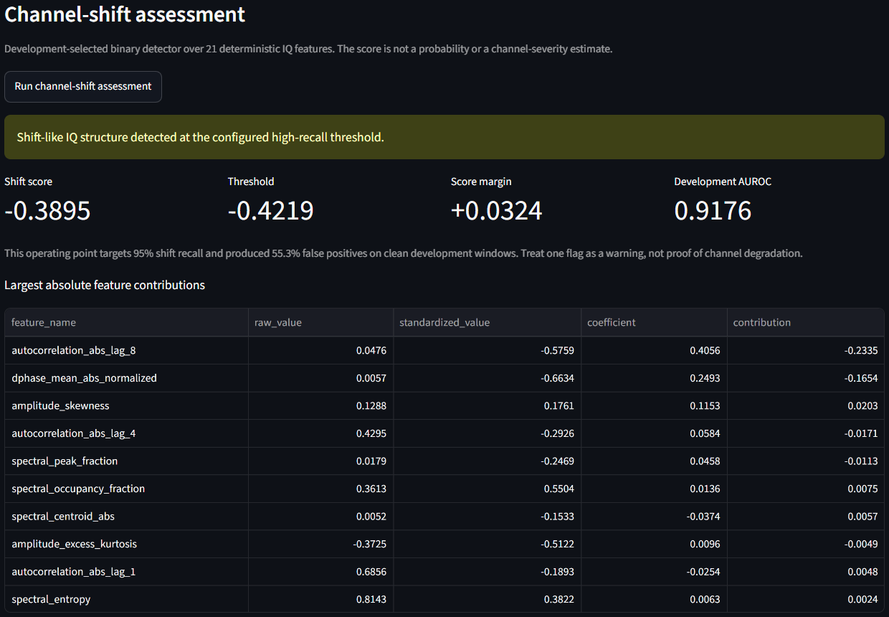
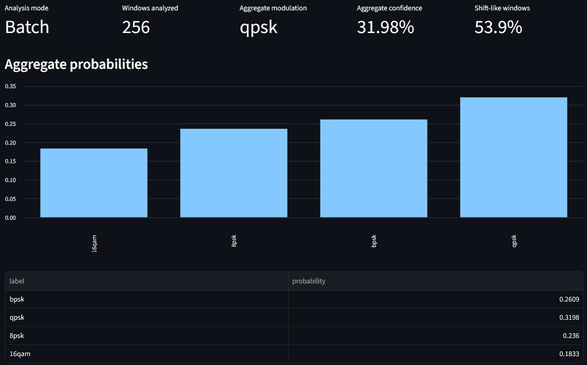

# RF Signal Intelligence Lab

A local, reproducible AI engineering project for RF modulation recognition from raw IQ signals.

The project covers the full path from signal generation and channel simulation to PyTorch training, model evaluation, deployment inference, channel-shift detection, long-signal analysis, and an interactive Streamlit application. It is built as a practical engineering system: the same trained components can be evaluated through scripts, tested through automated checks, and explored through a GUI.

## Current Release

**Version:** `v1.1.0`  
**Release focus:** Interactive Streamlit demo, deployable IQ channel-shift assessment, long-signal/batch analysis, JSON/CSV exports, README/report/screenshots, and complete validation.

The repository currently contains:

- Synthetic RF modulation generation for **BPSK**, **QPSK**, **8PSK**, and **16QAM**
- RF channel impairments such as AWGN, carrier offset, phase offset, amplitude scaling, timing shifts, Rayleigh fading, and frequency-selective multipath
- PyTorch CNN-based modulation recognition
- Five-seed reproducibility studies
- Frozen-head classifier refitting
- Multipath robustness experiments
- RadioML 2016.10A external-transfer evaluation
- Self-supervised learning experiments with SimCLR and VICReg
- Confidence-calibration experiments under channel shift
- IQ-feature-based channel-shift detection
- Fixed-window, long-signal, and streaming inference utilities
- Fresh-process CPU/CUDA inference benchmarking
- Interactive Streamlit GUI
- Technical reports, figures, release notes, and automated tests

## Interactive Streamlit Application

The Streamlit app is the main hands-on interface for the project. It allows a user to inspect IQ data, run modulation classification, assess channel shift, and analyze longer IQ recordings without manually calling each script.

Launch it from the repository root:

```powershell
python -m streamlit run app.py
```

The app uses:

```text
configs/streamlit_demo_v1.yaml
```

for default checkpoint paths, visualization settings, inference settings, long-analysis controls, and the exported shift-detector artifact.

### What the App Does

The GUI supports three main workflows.

#### 1. Single-Window IQ Classification

A user uploads an IQ file and selects one signal window. The app then:

- Reads `.npy` or `.npz` IQ input
- Displays the I/Q waveform
- Displays the constellation plot
- Displays the power spectrum
- Runs checkpoint-backed PyTorch modulation classification
- Shows the predicted class and confidence
- Shows the top-k probability table
- Exports the prediction as JSON
- Exports the probability table as CSV



#### 2. Channel-Shift Assessment

The app can run an exported IQ-feature channel-shift detector on the selected window. This detector does not classify the modulation. Instead, it checks whether the signal looks different from the clean training distribution.

The panel reports:

- Shift score
- Detector threshold
- Score margin
- Shift-like / not-shift-like decision
- Development AUROC
- Development false-positive behavior
- Largest IQ-feature contributions
- JSON and CSV exports



#### 3. Long-Signal and Batch Analysis

The app can process either:

- One long IQ recording, split into windows with a configurable stride
- A pre-windowed batch such as a validation dataset

The app then aggregates predictions and shows:

- Signal-level predicted modulation
- Aggregate class probabilities
- Mean confidence
- Number of analyzed windows
- Shift-like window count and fraction
- Per-window confidence timeline
- Per-window shift-score timeline
- Per-window predicted-class timeline
- Window-level table
- JSON and CSV exports



### Recommended Demo Input

For a local demonstration after generating the baseline dataset:

```text
data/processed/rf_modulation_baseline_v1/validation.npz
```

A validation example used during GUI validation was correctly classified as `8psk` with **68.38% confidence**. The corresponding IQ shift-detector score was `-0.3895` against a threshold of `-0.4219`, so it was flagged as shift-like at the selected high-recall operating point.

For pre-windowed batch analysis, the app processed the first 256 windows from a 1,400-window validation batch. The aggregate prediction was `qpsk` with **31.98% confidence**, and **138 of 256** analyzed windows were marked shift-like.

The full implementation and validation details are documented in [Streamlit Demo v1](reports/streamlit_demo_v1.md).

## What the Project Does

The project trains and evaluates machine-learning systems that recognize digital RF modulation types from raw IQ samples.

In simple terms:

1. A synthetic signal is generated for a known modulation type.
2. RF-like impairments are added to make the signal realistic.
3. The signal is converted into a two-channel IQ tensor.
4. A PyTorch model learns to classify the modulation.
5. The model is evaluated across classes, SNR levels, random seeds, and channel conditions.
6. Deployment utilities run predictions on fixed windows, long recordings, or streaming buffers.
7. A separate IQ-feature detector checks whether the signal distribution appears shifted.
8. The Streamlit app brings these pieces together into one local interactive interface.

The model input format is:

```text
[batch, 2, samples]
```

- Channel `0`: in-phase component, usually called `I`
- Channel `1`: quadrature component, usually called `Q`
- Default sample length: `2,048`

## Key RF Terms

### IQ Data

IQ data represents a radio signal using two components:

- **I**: in-phase component
- **Q**: quadrature component

Together, I and Q describe the signal amplitude and phase over time. This representation is common in software-defined radio and digital communication systems because it preserves the information needed to analyze modulation behavior.

### Modulation

Modulation is the method used to encode information into a signal. This project focuses on four modulation types:

| Term | Meaning | Simple explanation |
|---|---|---|
| BPSK | Binary Phase Shift Keying | Uses 2 phase states |
| QPSK | Quadrature Phase Shift Keying | Uses 4 phase states |
| 8PSK | 8 Phase Shift Keying | Uses 8 phase states |
| 16QAM | 16 Quadrature Amplitude Modulation | Uses 16 amplitude/phase points |

In constellation plots:

- BPSK usually appears as 2 main clusters
- QPSK usually appears as 4 main clusters
- 8PSK usually appears as 8 phase positions around a circle
- 16QAM usually appears as a 4×4 grid-like structure

### SNR

**SNR** means signal-to-noise ratio. Higher SNR means the signal is cleaner. Lower SNR means the signal is noisier and harder to classify.

The clean-channel benchmark evaluates SNR values from `-4 dB` to `20 dB`.

### AWGN

**AWGN** means additive white Gaussian noise. It is a standard noise model used to simulate random background noise in communication systems.

### Multipath

Multipath occurs when a transmitted signal reaches the receiver through multiple delayed paths, for example because of reflections. This can distort the signal and make modulation classification harder.

The project uses clean, mild, moderate, and severe multipath profiles.

### Channel Shift

Channel shift means the inference signal distribution is different from the training distribution. For example, a model trained mostly on clean signals may receive multipath-distorted signals during deployment. Accuracy and confidence can degrade when this happens.

### IQ Features

IQ features are deterministic measurements extracted directly from the raw IQ signal. In this project, 21 gain-invariant IQ features are used for shift detection. They measure properties such as temporal structure, phase behavior, autocorrelation, and signal geometry.

The selected channel-shift detector uses these features because they are more reliable than output confidence alone under multipath shift.

## Selected Results

### Clean-Channel Model

The selected clean-channel system is a compact 1D CNN with GroupNorm and a validation-selected frozen linear-head refit.

Result:

```text
96.50% ± 0.26 percentage points held-out test accuracy
```

across five independent seeds.

| Metric | Result |
|---|---:|
| Mean validation accuracy after head refit | 96.26% |
| Mean held-out test accuracy | 96.50% |
| Test standard deviation | 0.26 percentage points |
| Minimum test accuracy | 96.14% |
| Maximum test accuracy | 96.93% |
| Test examples per run | 1,400 |

Mean per-class accuracy:

| Modulation | Mean accuracy |
|---|---:|
| BPSK | 99.94% |
| QPSK | 93.14% |
| 8PSK | 93.94% |
| 16QAM | 98.97% |


Full details are in [Baseline CNN v1 Results](reports/baseline_cnn_v1.md).

### Multipath-Robust Models

The multipath benchmark trains and evaluates models across clean, mild, moderate, and severe multipath conditions.

| Model | Clean | Mild | Moderate | Severe |
|---|---:|---:|---:|---:|
| Mixed-I/Q baseline | 93.34% | 90.10% | 78.93% | 56.64% |
| Joint residual front end | 93.23% | 91.69% | **84.97%** | **65.59%** |
| Frozen-backbone residual front end | **94.21%** | **91.71%** | 84.67% | 63.84% |

The jointly trained residual front end is the selected maximum-robustness model. It improves moderate accuracy by **6.04 percentage points** and severe accuracy by **8.94 percentage points** relative to the mixed-I/Q baseline.

Full details are in [Learnable Residual Signal Front End v1](reports/learnable_residual_front_end_v1.md).

### RadioML External Transfer

The project also evaluates synthetic-trained models on a deterministic four-class subset of RadioML 2016.10A.

| Model | All SNRs | Shared grid |
|---|---:|---:|
| Mixed-IQ baseline | **52.54% ± 3.82%** | **67.03% ± 5.65%** |
| Joint residual, unscaled | 44.77% ± 2.59% | 54.86% ± 4.26% |
| Frozen residual, unscaled | 40.37% ± 3.08% | 49.34% ± 4.74% |
| Frozen residual, ×112 | **52.89% ± 3.95%** | **67.38% ± 5.93%** |

The plain mixed-I/Q model is selected for zero-shot external transfer because it gives the strongest baseline-level performance without dataset-specific input scaling.

Full details are in [RadioML 2016.10A External Transfer Evaluation v1](reports/radioml2016_external_transfer_v1.md).

### Self-Supervised Label Efficiency

The project compares random initialization, SimCLR, and VICReg at 1%, 5%, 10%, 25%, and 100% labels.

Selected systems:

| Intended use | Labels | Initialization | Clean | Mild | Moderate | Severe |
|---|---:|---|---:|---:|---:|---:|
| Clean low-label specialist | 1% | SimCLR | **75.76%** | 68.10% | 51.39% | 34.80% |
| Label-efficient compromise | 5% | VICReg | **92.24%** | **83.43%** | **63.03%** | 38.39% |
| Robust low-label model | 10% | VICReg | 93.64% | **84.50%** | **62.41%** | **37.51%** |
| Full-label model | 100% | Random | **95.29%** | **86.81%** | **65.26%** | **39.21%** |

Full details are in [SSL Label-Efficiency Evaluation v2](reports/ssl_label_efficiency_v2.md).

### Confidence Calibration

Validation-fitted scalar temperature scaling improves clean calibration but does not transfer reliably to multipath shift.

| Condition | Mean NLL change | Mean ECE change | NLL improved | ECE improved |
|---|---:|---:|---:|---:|
| Clean | **-0.03001** | **-0.03100** | **71/75** | **71/75** |
| Mild multipath | +0.16737 | +0.00916 | 16/75 | 16/75 |
| Moderate multipath | +0.92714 | +0.02241 | 16/75 | 16/75 |
| Severe multipath | +2.31736 | +0.01144 | 16/75 | 16/75 |

Negative changes are improvements. The result shows that clean validation calibration does not automatically solve confidence reliability under shifted channel conditions.

Full details are in [SSL Confidence Calibration Under Channel Shift v1](reports/ssl_confidence_calibration_v1.md).

### Channel-Shift Detection

The selected detector is an L2-regularized linear model over 21 deterministic IQ features.

| Condition | Mean AUROC | Mean AP | Mean FPR@95TPR |
|---|---:|---:|---:|
| Mild | 0.8312 | 0.8619 | 0.7671 |
| Moderate | 0.9512 | 0.9614 | 0.3129 |
| Severe | 0.9794 | 0.9829 | 0.1229 |

Output-only confidence signals are much weaker. IQ features work better because they measure the signal geometry and temporal/spectral structure directly.

Full details are in [Channel-Shift Detection from IQ Features v1](reports/channel_shift_detection_v1.md).

### Deployment Benchmark

Fresh-process benchmark results for the selected deployment checkpoint:

| Device | Batch | Mean latency | P95 latency | Throughput | Peak CUDA memory |
|---|---:|---:|---:|---:|---:|
| CPU | 1 | 1.32 ms | 1.65 ms | 759.6 windows/s | — |
| CPU | 32 | 14.09 ms | 15.56 ms | 2,270.7 windows/s | — |
| CUDA | 1 | 1.10 ms | 1.45 ms | 910.5 windows/s | 10.4 MiB |
| CUDA | 32 | 1.54 ms | 2.05 ms | 20,715.3 windows/s | 33.9 MiB |
| CUDA | 128 | 2.35 ms | 3.12 ms | **54,501.9 windows/s** | 107.4 MiB |

Full details are in [Deployment and IQ Inference Evaluation v1](reports/deployment_inference_v1.md).

## Architecture and Workflow

### Signal Pipeline

Each synthetic example follows this pipeline:

1. Random modulation-symbol generation
2. Root-raised-cosine transmit pulse shaping
3. Fixed-length waveform extraction
4. Amplitude scaling
5. Optional flat Rayleigh fading
6. Optional frequency-selective tapped-delay-line multipath
7. Carrier frequency offset
8. Carrier phase offset
9. Zero-padded integer timing shift
10. AWGN at the configured SNR
11. Conversion to `[2, samples]` IQ tensor

### Selected Clean-Channel Model

```text
Input: [batch, 2, 2048]

Conv block: 2 → 32
Conv block: 32 → 64
Conv block: 64 → 128
Adaptive global average pooling
128-dimensional embedding
Dropout
Linear classifier: 128 → 4
```

Each convolutional block contains:

- `Conv1d`
- GroupNorm with 8 groups
- GELU activation
- Max pooling

Trainable parameters:

```text
73,092
```

### Frozen-Head Refit

The frozen-head refit keeps the CNN encoder fixed, extracts 128-dimensional embeddings, fits a standardized logistic-regression classifier, selects regularization on validation data, converts the classifier into raw PyTorch linear weights, and stores the result as a native PyTorch checkpoint.

This improved the mean held-out test result from:

```text
95.29% ± 0.45 percentage points
```

to:

```text
96.50% ± 0.26 percentage points
```

without changing the CNN encoder.

## Installation and Quick Start

### 1. Clone the Repository

```powershell
git clone https://github.com/AdnanTawkul/rf-signal-intelligence-lab.git
cd rf-signal-intelligence-lab
```

### 2. Create and Activate a Virtual Environment

```powershell
py -3.12 -m venv .venv
.\.venv\Scripts\Activate.ps1
```

### 3. Install Dependencies

Upgrade packaging tools:

```powershell
python -m pip install --upgrade pip setuptools wheel
```

Install PyTorch with CUDA support:

```powershell
python -m pip install torch --index-url https://download.pytorch.org/whl/cu128
```

Install project dependencies:

```powershell
python -m pip install -r requirements.txt
```

### 4. Verify GPU Availability

```powershell
python -c "import torch; print(torch.__version__); print(torch.cuda.is_available()); print(torch.cuda.get_device_name(0) if torch.cuda.is_available() else 'NO CUDA DEVICE')"
```

### 5. Generate the Baseline Dataset

```powershell
python scripts/generate_dataset.py --config configs/dataset_baseline_v1.yaml
```

Expected split sizes:

| Split | Examples |
|---|---:|
| Train | 5,600 |
| Validation | 1,400 |
| Test | 1,400 |

Generated datasets are stored under `data/processed/` and are intentionally excluded from Git.

### 6. Launch the Streamlit App

```powershell
python -m streamlit run app.py
```

Recommended local input after dataset generation:

```text
data/processed/rf_modulation_baseline_v1/validation.npz
```

## Using the Application

### Single-Window Workflow

1. Launch the app.
2. Upload a `.npy` or `.npz` IQ file.
3. Select the IQ array key, usually `iq`.
4. Select one window.
5. Review the waveform, constellation, and spectrum.
6. Run modulation classification.
7. Review the predicted class, confidence, and probability table.
8. Run channel-shift assessment.
9. Review the shift score, threshold, margin, and feature contributions.
10. Export JSON and CSV files if needed.

### Long-Signal / Batch Workflow

1. Upload a long IQ signal or pre-windowed batch.
2. Choose stride, remainder handling, batch size, and maximum analyzed windows.
3. Run long analysis.
4. Review aggregate probabilities and signal-level prediction.
5. Review confidence, shift-score, and predicted-class timelines.
6. Export JSON and CSV results.

## Script-Based Inference

The same backend components can be used without the GUI.

### Fixed-Window Prediction

```powershell
python scripts/predict_iq.py `
  --checkpoint results/ssl_label_efficiency_seed_sweep_v2/labels_100pct/random/seed_2026/best_model.pt `
  --input data/processed/rf_modulation_baseline_v1/test.npz `
  --sample-index 0 `
  --device auto `
  --expected-samples 2048 `
  --top-k 4 `
  --output results/deployment_inference_v1/sample_prediction.json
```

### Long-Signal Prediction

```powershell
python scripts/predict_long_iq.py `
  --checkpoint results/ssl_label_efficiency_seed_sweep_v2/labels_100pct/random/seed_2026/best_model.pt `
  --input path/to/long_signal.npy `
  --device auto `
  --window-size 2048 `
  --stride 1024 `
  --remainder pad `
  --batch-size 32 `
  --top-k 4 `
  --output results/deployment_inference_v1/long_prediction.json
```

### Streaming Simulation

```powershell
python scripts/stream_iq.py `
  --checkpoint results/ssl_label_efficiency_seed_sweep_v2/labels_100pct/random/seed_2026/best_model.pt `
  --input path/to/long_signal.npy `
  --device auto `
  --window-size 2048 `
  --hop-size 1024 `
  --chunk-size 256 `
  --sample-rate-hz 1000000 `
  --output results/deployment_inference_v1/stream_prediction.json
```

## Reproducing Main Experiments

### Clean-Channel Baseline

```powershell
python scripts/run_baseline_seed_sweep.py --config configs/baseline_groupnorm_seed_sweep_v1.yaml
python scripts/run_frozen_head_refit_seed_sweep.py --config configs/refit_groupnorm_head_seed_sweep_v1.yaml
python scripts/evaluate_seed_sweep.py --config configs/evaluate_groupnorm_head_refit_seed_sweep_v1.yaml
```

### Multipath-Robust Models

```powershell
python scripts/run_baseline_seed_sweep.py --config configs/baseline_groupnorm_residual_equalizer_seed_sweep_v1.yaml
python scripts/compare_multipath_mitigation.py --config configs/compare_residual_equalizer_v1.yaml
```

### RadioML External Transfer

```powershell
python scripts/convert_radioml2016.py --config configs/dataset_radioml2016_four_class_v1.yaml
python scripts/analyze_radioml2016_external_transfer.py --config configs/compare_radioml2016_external_transfer_v1.yaml
```

### SSL Label Efficiency

```powershell
python scripts/run_ssl_label_efficiency_seed_sweep.py --config configs/ssl_label_efficiency_seed_sweep_v2.yaml --dry-run
python scripts/execute_ssl_label_efficiency_seed_sweep.py --manifest results/ssl_label_efficiency_seed_sweep_v2/dry_run_manifest.json --resume
python scripts/evaluate_ssl_label_efficiency.py --config configs/evaluate_ssl_label_efficiency_v2.yaml --resume
python scripts/analyze_ssl_label_efficiency.py --config configs/analyze_ssl_label_efficiency_v2.yaml
```

### Confidence Calibration

```powershell
python scripts/fit_ssl_validation_temperatures.py --config configs/fit_ssl_validation_temperatures_v1.yaml
python scripts/backfill_ssl_calibration_predictions.py --config configs/backfill_ssl_calibration_predictions_v1.yaml
python scripts/analyze_ssl_calibration.py --config configs/analyze_ssl_calibration_v1.yaml
```

### Channel-Shift Detection

```powershell
python scripts/extract_iq_channel_features.py --config configs/extract_iq_channel_features_v1.yaml
python scripts/analyze_linear_iq_shift_detection.py --config configs/analyze_linear_iq_shift_detection_v1.yaml
python scripts/compare_channel_shift_detectors.py --config configs/compare_channel_shift_detectors_v1.yaml
```

## Implementation Map

| Area | Main files |
|---|---|
| Streamlit app | `app.py`, `src/rfsil/demo/` |
| Demo configuration | `configs/streamlit_demo_v1.yaml` |
| Signal generation | `src/rfsil/dsp/`, `scripts/generate_dataset.py` |
| Dataset loading | `src/rfsil/data/` |
| CNN model | `src/rfsil/models/` |
| Training | `src/rfsil/training/`, `scripts/run_baseline_seed_sweep.py` |
| Evaluation | `src/rfsil/evaluation/`, `scripts/evaluate_seed_sweep.py` |
| Deployment inference | `src/rfsil/deployment/`, `scripts/predict_iq.py`, `scripts/predict_long_iq.py`, `scripts/stream_iq.py` |
| Shift detection | `src/rfsil/deployment/shift_detector.py`, `scripts/export_iq_shift_detector.py` |
| Tests | `tests/` |
| Reports | `reports/` |
| Figures | `reports/figures/` |

## Quality Checks

Run the full test suite:

```powershell
python -m pytest -W error
```

Run static analysis:

```powershell
python -m ruff check src tests scripts app.py
```

Check patch integrity:

```powershell
git diff --check
```

Current validation:

```text
1,091 passing tests
```

## Repository Structure

```text
rf-signal-intelligence-lab/
├── README.md
├── app.py
├── requirements.txt
├── pyproject.toml
├── configs/
├── data/
├── scripts/
├── src/
│   └── rfsil/
│       ├── data/
│       ├── dsp/
│       ├── models/
│       ├── ssl/
│       ├── training/
│       ├── evaluation/
│       ├── deployment/
│       └── demo/
├── tests/
├── reports/
│   └── figures/
└── results/
```

## Environment

The original development environment uses:

- Windows
- PowerShell
- Python 3.12
- PyTorch 2.11.0 with CUDA 12.8
- NVIDIA RTX 4080 SUPER
- 64 GB RAM
- Git and GitHub

The project runs locally. It does not require cloud services, paid APIs, or the OpenAI API.

## Safety Scope

This project is limited to synthetic and public-dataset RF signal analysis for education, research, and local engineering demonstration.

It does not include:

- Jamming
- Evasion
- Targeting
- Weapon guidance
- Operational military procedures
- Instructions for disrupting communication systems

## Known Limitations

- RadioML 2016.10A is a synthetic benchmark rather than over-the-air captured data.
- Real receiver effects and hardware-specific distortions are not yet fully represented.
- RadioML windows contain 128 samples, while the main models were trained on 2,048-sample windows.
- Validation-selected input scaling is treated as a post-hoc diagnostic, not an untouched confirmatory result.
- Low-SNR and severe-multipath PSK discrimination remain the dominant failure regimes.
- Residual front ends reduce, but do not eliminate, QPSK/8PSK confusion under severe multipath.
- The learned residual front-end transformations are not established physical channel inverses.
- Clean-validation temperature scaling does not transfer reliably to multipath channel shift.
- Model-output uncertainty is not a reliable multipath detector.
- The IQ detector is evaluated on paired synthetic channel variants; transfer to unpaired receivers and over-the-air recordings still requires validation.
- Mild multipath remains difficult at high recall.
- The Streamlit app is a local engineering interface, not a hosted production service.
- Long-analysis GUI runs intentionally cap the number of analyzed windows for interactive responsiveness.
- Deployment benchmarking is hardware-, driver-, OS-, and checkpoint-specific.
- The benchmark excludes file-reading, JSON serialization, acquisition-device, and network-service overhead.
- ONNX, TensorRT, quantization, and mixed-precision deployment are not implemented.

## License

This project is licensed under the MIT License.
