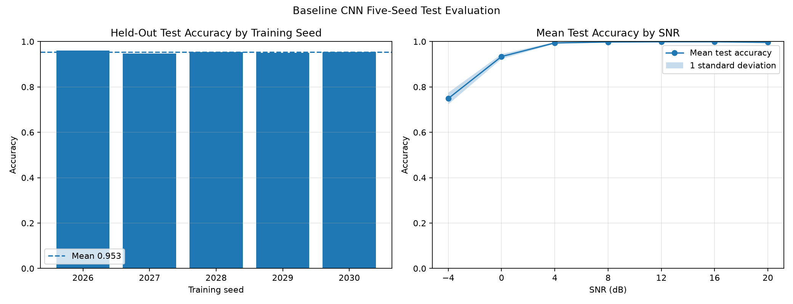

# RF Signal Intelligence Lab

A local, reproducible AI engineering project for RF modulation recognition from synthetic raw IQ signals.

The repository covers the full experimental path from signal generation and channel simulation to PyTorch training, held-out evaluation, multi-seed reproducibility studies, architecture ablations, and deployment-oriented extensions. It is designed as a serious portfolio project for AI, RF, signal-processing, and applied ML engineering roles.

## Current Status

The project currently includes:

- Synthetic BPSK, QPSK, 8PSK, and 16QAM generation
- Root-raised-cosine pulse shaping
- AWGN with controlled SNR
- Carrier frequency and phase offsets
- Amplitude scaling
- Zero-padded timing shifts
- Flat Rayleigh block fading
- IQ, constellation, waveform, and spectrogram visualizations
- Reproducible balanced dataset generation
- PyTorch `Dataset` and `DataLoader` integration
- A compact one-dimensional CNN classifier
- Configurable BatchNorm and GroupNorm support
- Optional per-example RMS IQ normalization
- GPU training on an NVIDIA RTX 4080 SUPER
- Held-out evaluation by class and SNR
- Confusion-matrix and class-by-SNR error analysis
- Five-seed training and test reproducibility studies
- RMS-normalization and GroupNorm ablations
- Automated tests with `pytest`
- Static analysis with Ruff

The selected supervised model now uses GroupNorm. The next major research milestones are self-supervised representation learning, uncertainty calibration, public-dataset validation, ONNX export, local latency benchmarking, and a Streamlit demo.

## Selected Supervised Baseline

The statistically defensible selected result is:

> **95.29% ± 0.45 percentage points held-out test accuracy across five independent training seeds**

Five independently trained GroupNorm checkpoints were evaluated on the same untouched balanced test split.

| Metric | Result |
|---|---:|
| Mean test accuracy | 95.29% |
| Standard deviation | 0.45 percentage points |
| Minimum test accuracy | 94.71% |
| Maximum test accuracy | 96.07% |
| Mean accuracy at -4 dB | 74.90% |
| Test examples per run | 1,400 |

### Mean Per-Class Accuracy Across Five Seeds

| Modulation | Mean accuracy | Standard deviation |
|---|---:|---:|
| BPSK | 99.89% | 0.23 percentage points |
| QPSK | 92.23% | 2.05 percentage points |
| 8PSK | 89.94% | 2.74 percentage points |
| 16QAM | 99.09% | 0.66 percentage points |

### Mean Accuracy by SNR Across Five Seeds

| SNR | Mean accuracy | Standard deviation |
|---:|---:|---:|
| -4 dB | 74.90% | 2.58 percentage points |
| 0 dB | 93.40% | 1.07 percentage points |
| 4 dB | 99.40% | 0.37 percentage points |
| 8 dB | 99.80% | 0.24 percentage points |
| 12 dB | 99.90% | 0.20 percentage points |
| 16 dB | 99.90% | 0.20 percentage points |
| 20 dB | 99.70% | 0.60 percentage points |



Detailed methodology, BatchNorm results, RMS-normalization ablation, GroupNorm comparison, limitations, and five-seed evidence are documented in [Baseline CNN v1 Results](reports/baseline_cnn_v1.md).

## Why GroupNorm Was Selected

The original BatchNorm baseline achieved:

```text
94.24% ± 0.29 percentage points
```

The GroupNorm variant improved the five-seed mean test accuracy to:

```text
95.29% ± 0.45 percentage points
```

It also improved:

- Mean QPSK accuracy by 4.46 percentage points
- Mean 16QAM accuracy by 2.75 percentage points
- Mean accuracy at -4 dB by 4.40 percentage points
- Worst-seed test accuracy by 0.78 percentage points
- Mean final validation accuracy by 5.71 percentage points
- Final-validation stability

The tradeoff is explicit. Mean 8PSK accuracy decreased by 3.15 percentage points, and overall test variance increased slightly. GroupNorm is therefore selected as the stronger overall baseline, not presented as uniformly superior in every class.

## Signal and Dataset Pipeline

Each synthetic classification example follows this pipeline:

1. Random modulation-symbol generation
2. Root-raised-cosine transmit pulse shaping
3. Fixed-length waveform extraction
4. Amplitude scaling
5. Optional flat Rayleigh fading
6. Carrier frequency offset
7. Carrier phase offset
8. Zero-padded integer timing shift
9. AWGN at the configured SNR
10. Conversion to a two-channel tensor

The model input format is:

```text
[batch, 2, samples]
```

- Channel 0: in-phase component
- Channel 1: quadrature component
- Default baseline sample length: 2,048 samples

The generated dataset stores labels and impairment metadata, including SNR, frequency offset, phase offset, amplitude scale, timing shift, fading state, and generation seed.

## Selected Model

The selected supervised model is a compact one-dimensional CNN.

```text
Input: [batch, 2, 2048]

Conv block: 2 → 32
Conv block: 32 → 64
Conv block: 64 → 128
Adaptive global average pooling
Dropout
Linear classifier: 128 → 4
```

Each convolutional block contains:

- `Conv1d`
- GroupNorm with 8 groups
- GELU activation
- Max pooling

Trainable parameters:

```text
73,092
```

RMS input normalization remains implemented as an optional checkpointed setting, but it is disabled in the selected model because the five-seed ablation reduced mean test accuracy and increased variance.

## Reproducibility Findings

### GroupNorm Validation Performance

Best-checkpoint validation accuracy across five seeds:

```text
95.64% ± 0.40 percentage points
```

Final-epoch validation accuracy across five seeds:

```text
94.10% ± 2.34 percentage points
```

### BatchNorm Comparison

The earlier BatchNorm model produced:

```text
Best validation: 94.17% ± 0.31 percentage points
Final validation: 88.39% ± 4.13 percentage points
```

GroupNorm substantially improved late-training behavior and reduced the dependence on unstable BatchNorm running statistics. Best-checkpoint selection is still retained as the experimental protocol.

## RMS Normalization Ablation

Per-example complex RMS normalization was tested without changing the dataset, architecture, optimizer, batch size, epoch count, or seeds.

Its single-seed result looked promising, but the five-seed result was worse:

| Metric | BatchNorm baseline | RMS-normalized |
|---|---:|---:|
| Mean test accuracy | 94.24% | 93.93% |
| Test standard deviation | 0.29 pp | 0.80 pp |
| Minimum test accuracy | 93.93% | 92.43% |
| Mean accuracy at -4 dB | 70.50% | 68.90% |

RMS normalization is therefore retained as an ablation and optional feature, not used as the default preprocessing path.

## Quick Start

### 1. Clone the repository

```powershell
git clone https://github.com/AdnanTawkul/rf-signal-intelligence-lab.git
cd rf-signal-intelligence-lab
```

### 2. Create and activate the virtual environment

```powershell
py -3.12 -m venv .venv
.\.venv\Scripts\Activate.ps1
```

### 3. Upgrade packaging tools

```powershell
python -m pip install --upgrade pip setuptools wheel
```

### 4. Install PyTorch with CUDA support

The development environment uses the official PyTorch CUDA 12.8 wheel channel:

```powershell
python -m pip install torch --index-url https://download.pytorch.org/whl/cu128
```

### 5. Install project dependencies

```powershell
python -m pip install -r requirements.txt
```

### 6. Verify the GPU

```powershell
python -c "import torch; print(torch.__version__); print(torch.cuda.is_available()); print(torch.cuda.get_device_name(0) if torch.cuda.is_available() else 'NO CUDA DEVICE')"
```

Expected hardware in the original development environment:

```text
NVIDIA GeForce RTX 4080 SUPER
```

## Reproduce the Selected GroupNorm Baseline

### Generate the baseline dataset

```powershell
python scripts\generate_dataset.py --config configs\dataset_baseline_v1.yaml
```

Expected split sizes:

| Split | Examples |
|---|---:|
| Train | 5,600 |
| Validation | 1,400 |
| Test | 1,400 |

Generated datasets are stored under `data/processed/` and are intentionally excluded from Git.

### Train one GroupNorm model

```powershell
python scripts\train_baseline.py --config configs\train_baseline_groupnorm_v1.yaml
```

### Evaluate the selected GroupNorm checkpoint

```powershell
python scripts\evaluate_baseline.py --config configs\evaluate_baseline_groupnorm_v1.yaml
```

### Run the five-seed GroupNorm training study

```powershell
python scripts\run_baseline_seed_sweep.py --config configs\baseline_groupnorm_seed_sweep_v1.yaml
```

### Evaluate all five GroupNorm checkpoints

```powershell
python scripts\evaluate_seed_sweep.py --config configs\evaluate_groupnorm_seed_sweep_v1.yaml
```

## Reproduce Historical Ablations

### BatchNorm five-seed study

```powershell
python scripts\run_baseline_seed_sweep.py --config configs\baseline_seed_sweep_v1.yaml
python scripts\evaluate_seed_sweep.py --config configs\evaluate_seed_sweep_v1.yaml
```

### RMS-normalized five-seed study

```powershell
python scripts\run_baseline_seed_sweep.py --config configs\baseline_rms_seed_sweep_v1.yaml
python scripts\evaluate_seed_sweep.py --config configs\evaluate_rms_seed_sweep_v1.yaml
```

## Quality Checks

Run the complete test suite:

```powershell
python -m pytest
```

Run static analysis:

```powershell
python -m ruff check src tests scripts
```

Check whitespace and patch integrity:

```powershell
git diff --check
```

At the current milestone, the repository contains **223 passing tests**.

## Repository Structure

```text
rf-signal-intelligence-lab/
├── README.md
├── requirements.txt
├── pyproject.toml
├── .gitignore
├── LICENSE
├── configs/
├── data/
│   ├── raw/
│   ├── processed/
│   └── README.md
├── notebooks/
├── scripts/
├── src/
│   └── rfsil/
│       ├── data/
│       ├── dsp/
│       ├── models/
│       ├── ssl/
│       ├── training/
│       ├── evaluation/
│       ├── deployment/
│       └── demo/
├── tests/
├── reports/
│   └── figures/
└── results/
```

## Environment

The original development environment uses:

- Windows
- PowerShell
- Python 3.12
- PyTorch 2.11.0 with CUDA 12.8
- NVIDIA RTX 4080 SUPER
- 64 GB RAM
- PyCharm
- Git
- GitHub Desktop

The project runs locally. It does not require cloud services, paid APIs, or the OpenAI API.

## Safety Scope

This project is limited to synthetic and public-dataset RF signal analysis for education, research, and portfolio development.

It does not include:

- Jamming
- Evasion
- Targeting
- Weapon guidance
- Operational military procedures
- Instructions for disrupting communication systems

## Known Limitations

- The current benchmark is entirely synthetic.
- Training and test data come from the same signal-generator family.
- Real receiver effects and hardware-specific distortions are not yet represented fully.
- Public RF datasets have not yet been integrated.
- Low-SNR classification remains the dominant failure regime.
- GroupNorm improves QPSK and 16QAM but reduces mean 8PSK accuracy.
- Confidence calibration and uncertainty estimation are not yet implemented.
- No self-supervised representation-learning result is available yet.
- Deployment benchmarking and ONNX export are not yet implemented.

## Roadmap

### Completed

- [x] Reproducible Windows and CUDA environment
- [x] Synthetic modulation generation
- [x] Signal impairment pipeline
- [x] Root-raised-cosine pulse shaping
- [x] IQ, constellation, waveform, and spectrogram visualizations
- [x] Balanced dataset generation
- [x] PyTorch dataset loader
- [x] Baseline one-dimensional CNN
- [x] GPU training pipeline
- [x] Held-out evaluation
- [x] Confusion matrix
- [x] Accuracy-by-SNR analysis
- [x] Class-by-SNR error analysis
- [x] Five-seed reproducibility study
- [x] RMS-normalization ablation
- [x] BatchNorm versus GroupNorm ablation
- [x] GroupNorm baseline selection
- [x] Automated testing and Ruff checks

### Next

- [ ] Investigate the GroupNorm 8PSK regression
- [ ] Low-SNR-aware training experiments
- [ ] Confidence calibration
- [ ] Uncertainty estimation
- [ ] Self-supervised contrastive encoder
- [ ] Linear evaluation and fine-tuning
- [ ] Public RF dataset integration
- [ ] ONNX export
- [ ] Local latency benchmark
- [ ] Streamlit demo
- [ ] Final technical report and GitHub release

## License

This project is licensed under the MIT License.
