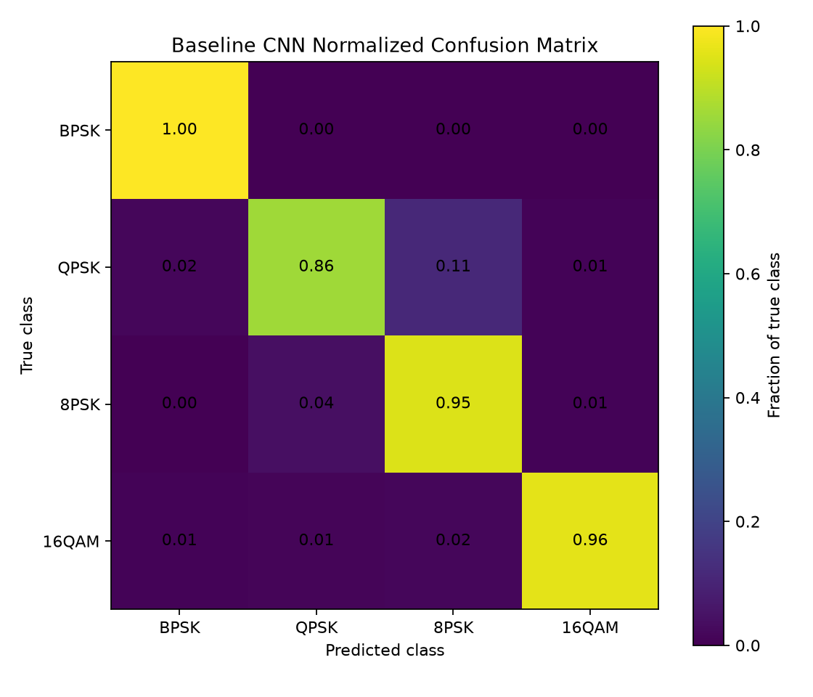
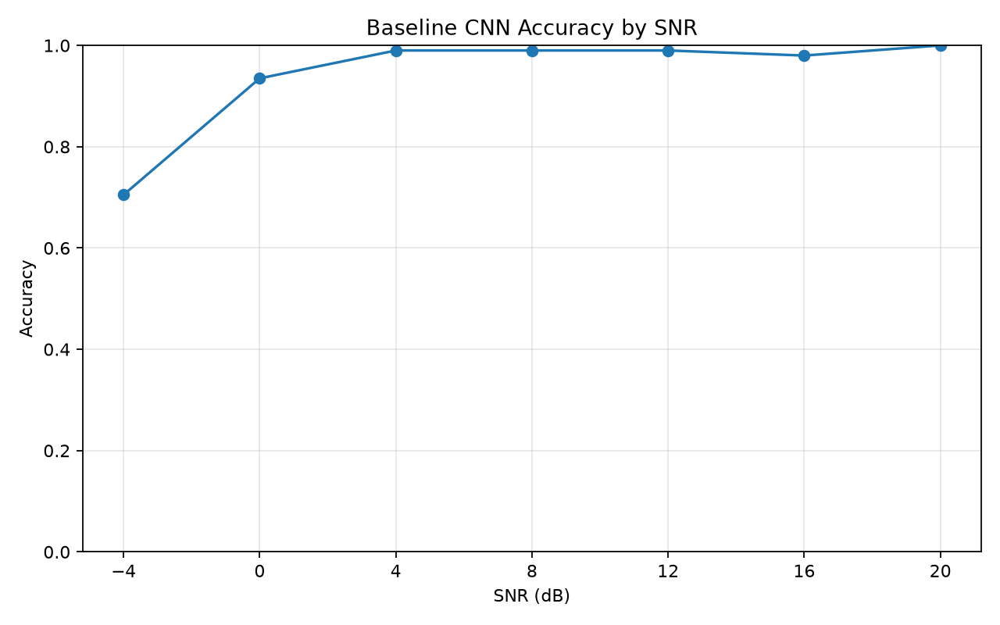
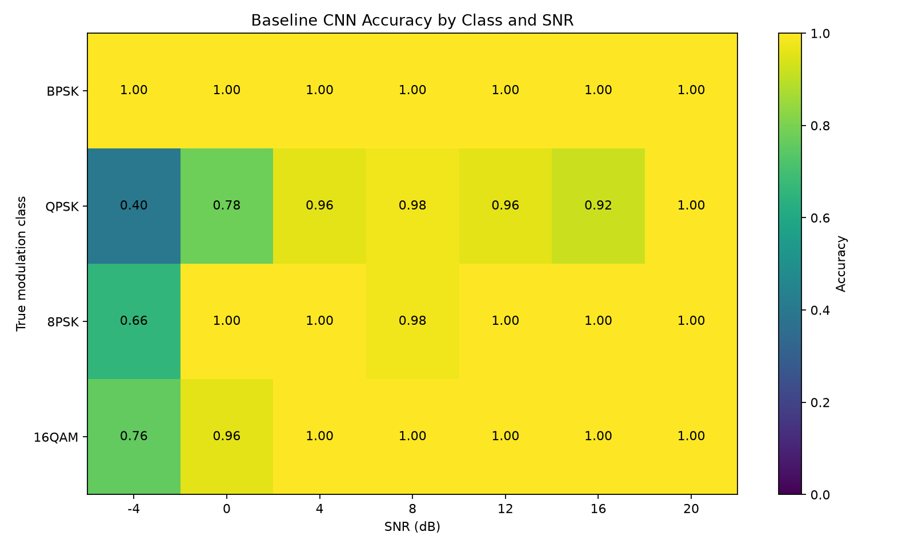

# Baseline CNN v1 Results

## Overview

Baseline CNN v1 is a compact one-dimensional convolutional neural network trained directly on synthetic raw IQ sequences.

The model input shape is:

```text
[batch, 2, 2048]
```

Channel 0 contains the in-phase component. Channel 1 contains the quadrature component.

## Dataset

The dataset contains four modulation classes:

- BPSK
- QPSK
- 8PSK
- 16QAM

Dataset size:

| Split | Examples |
|---|---:|
| Training | 5,600 |
| Validation | 1,400 |
| Test | 1,400 |
| Total | 8,400 |

Each split is balanced by modulation class and SNR.

Evaluated SNR levels:

```text
-4, 0, 4, 8, 12, 16, 20 dB
```

Synthetic examples include:

- Root-raised-cosine pulse shaping
- AWGN
- Carrier frequency offset
- Carrier phase offset
- Amplitude variation
- Integer time shift
- Limited flat Rayleigh fading

## Model

The baseline classifier contains three one-dimensional convolutional blocks:

```text
2 → 32 → 64 → 128 channels
```

Each block contains:

- One-dimensional convolution
- Batch normalization
- GELU activation
- Max pooling

Global average pooling and a linear layer produce four class logits.

Trainable parameters:

```text
73,092
```

## Training

| Setting | Value |
|---|---:|
| Epochs | 30 |
| Batch size | 128 |
| Learning rate | 0.001 |
| Weight decay | 0.0001 |
| Optimizer | AdamW |
| Best epoch | 24 |
| Best validation accuracy | 94.3% |

Validation performance fluctuated substantially during training. This indicates sensitivity to optimization or BatchNorm statistics and must not be hidden behind the best checkpoint result.

## Held-Out Test Results

Overall test accuracy:

```text
94.14%
```

Per-class accuracy:

| Modulation | Accuracy |
|---|---:|
| BPSK | 100.00% |
| QPSK | 85.71% |
| 8PSK | 94.86% |
| 16QAM | 96.00% |

Accuracy by SNR:

| SNR | Accuracy |
|---:|---:|
| -4 dB | 70.50% |
| 0 dB | 93.50% |
| 4 dB | 99.00% |
| 8 dB | 99.00% |
| 12 dB | 99.00% |
| 16 dB | 98.00% |
| 20 dB | 100.00% |

## Confusion Matrix



## Accuracy by SNR



## Class-by-SNR Error Analysis



The class-by-SNR breakdown identifies the dominant failure mode:

| Modulation | Accuracy at -4 dB |
|---|---:|
| BPSK | 100.0% |
| QPSK | 40.0% |
| 8PSK | 66.0% |
| 16QAM | 76.0% |

QPSK at -4 dB is the worst evaluated class-SNR group.

This means the main weakness is not general classification capacity. The model struggles to distinguish phase-based constellations when noise severely corrupts instantaneous phase information.

## Limitations

1. The dataset is entirely synthetic.
2. No public real-world RF dataset has been evaluated yet.
3. The test distribution uses the same generator family as training.
4. Low-SNR QPSK performance is poor.
5. Training validation metrics fluctuate significantly.
6. Confidence calibration and uncertainty have not been evaluated.
7. Results are from one model-training seed.
8. No architecture comparison or ablation study has been performed.

## Next Research Targets

The next experiments should target evidence, not random tuning:

1. Inspect the exact QPSK confusion destinations at -4 dB.
2. Run multiple training seeds to measure result variance.
3. Evaluate normalization strategies that reduce amplitude and channel-gain sensitivity.
4. Compare BatchNorm with GroupNorm.
5. Test low-SNR-aware sampling or curriculum strategies.
6. Add confidence calibration and uncertainty evaluation.
7. Evaluate on a public RF modulation dataset.
