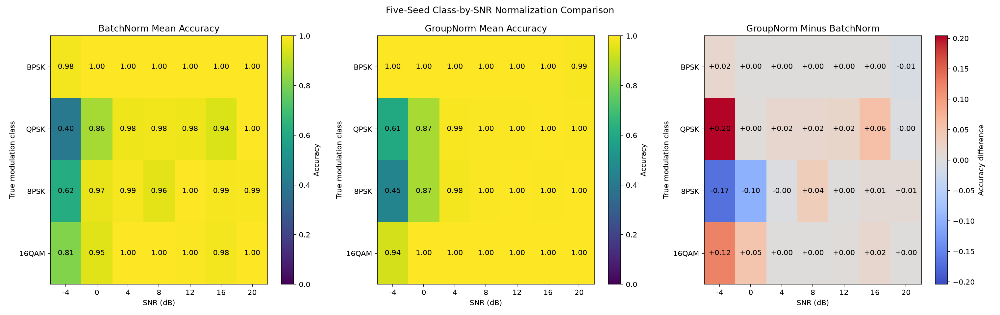

# Baseline CNN v1 Results

## Overview

Baseline CNN v1 is a compact one-dimensional convolutional neural network trained directly on synthetic raw IQ sequences.

The model input shape is:

```text
[batch, 2, 2048]
```

Channel 0 contains the in-phase component. Channel 1 contains the quadrature component.

## Dataset

The dataset contains four modulation classes:

- BPSK
- QPSK
- 8PSK
- 16QAM

Dataset size:

| Split | Examples |
|---|---:|
| Training | 5,600 |
| Validation | 1,400 |
| Test | 1,400 |
| Total | 8,400 |

Each split is balanced by modulation class and SNR.

Evaluated SNR levels:

```text
-4, 0, 4, 8, 12, 16, 20 dB
```

Synthetic examples include:

- Root-raised-cosine pulse shaping
- AWGN
- Carrier frequency offset
- Carrier phase offset
- Amplitude variation
- Integer time shift
- Limited flat Rayleigh fading

## Model

The baseline classifier contains three one-dimensional convolutional blocks:

```text
2 → 32 → 64 → 128 channels
```

Each block contains:

- One-dimensional convolution
- Batch normalization
- GELU activation
- Max pooling

Global average pooling and a linear layer produce four class logits.

Trainable parameters:

```text
73,092
```

## Training

| Setting | Value |
|---|---:|
| Epochs | 30 |
| Batch size | 128 |
| Learning rate | 0.001 |
| Weight decay | 0.0001 |
| Optimizer | AdamW |
| Best epoch | 24 |
| Best validation accuracy | 94.3% |

Validation performance fluctuated substantially during training. This indicates sensitivity to optimization or BatchNorm statistics and must not be hidden behind the best checkpoint result.

## Held-Out Test Results

Overall test accuracy:

```text
94.14%
```

Per-class accuracy:

| Modulation | Accuracy |
|---|---:|
| BPSK | 100.00% |
| QPSK | 85.71% |
| 8PSK | 94.86% |
| 16QAM | 96.00% |

Accuracy by SNR:

| SNR | Accuracy |
|---:|---:|
| -4 dB | 70.50% |
| 0 dB | 93.50% |
| 4 dB | 99.00% |
| 8 dB | 99.00% |
| 12 dB | 99.00% |
| 16 dB | 98.00% |
| 20 dB | 100.00% |

## Confusion Matrix


## Accuracy by SNR


## Class-by-SNR Error Analysis


The class-by-SNR breakdown identifies the dominant failure mode:

| Modulation | Accuracy at -4 dB |
|---|---:|
| BPSK | 100.0% |
| QPSK | 40.0% |
| 8PSK | 66.0% |
| 16QAM | 76.0% |

QPSK at -4 dB is the worst evaluated class-SNR group.

This means the main weakness is not general classification capacity. The model struggles to distinguish phase-based constellations when noise severely corrupts instantaneous phase information.

## Limitations

1. The dataset is entirely synthetic.
2. No public real-world RF dataset has been evaluated yet.
3. The test distribution uses the same generator family as training.
4. Low-SNR QPSK performance is poor.
5. Training validation metrics fluctuate significantly.
6. Confidence calibration and uncertainty have not been evaluated.
7. Results are from one model-training seed.
8. No architecture comparison or ablation study has been performed.

## Next Research Targets

The next experiments should target evidence, not random tuning:

1. Inspect the exact QPSK confusion destinations at -4 dB.
2. Run multiple training seeds to measure result variance.
3. Evaluate normalization strategies that reduce amplitude and channel-gain sensitivity.
4. Compare BatchNorm with GroupNorm.
5. Test low-SNR-aware sampling or curriculum strategies.
6. Add confidence calibration and uncertainty evaluation.
7. Evaluate on a public RF modulation dataset.

## Five-Seed Reproducibility Study

The baseline architecture was trained independently using five random seeds:

```text
2026, 2027, 2028, 2029, 2030
```

For every run, the checkpoint with the highest validation accuracy was evaluated on the same untouched test split.

### Aggregate Held-Out Test Accuracy

| Metric | Result |
|---|---:|
| Mean test accuracy | 94.24% |
| Standard deviation | 0.29 percentage points |
| Minimum | 93.93% |
| Maximum | 94.71% |

Individual test accuracies:

| Seed | Test accuracy |
|---:|---:|
| 2026 | 94.14% |
| 2027 | 94.71% |
| 2028 | 94.00% |
| 2029 | 94.43% |
| 2030 | 93.93% |

The narrow range confirms that the original baseline result was not caused by a favorable random seed.

### Mean Per-Class Accuracy

| Modulation | Mean accuracy | Standard deviation |
|---|---:|---:|
| BPSK | 99.77% | 0.33 percentage points |
| QPSK | 87.77% | 2.32 percentage points |
| 8PSK | 93.09% | 3.15 percentage points |
| 16QAM | 96.34% | 1.72 percentage points |

BPSK is essentially solved under the current synthetic distribution. QPSK and 8PSK show the greatest variation across independently trained models.

### Mean Accuracy by SNR

| SNR | Mean accuracy | Standard deviation |
|---:|---:|---:|
| -4 dB | 70.50% | 1.10 percentage points |
| 0 dB | 94.60% | 1.07 percentage points |
| 4 dB | 99.10% | 0.37 percentage points |
| 8 dB | 98.50% | 0.45 percentage points |
| 12 dB | 99.30% | 0.24 percentage points |
| 16 dB | 97.90% | 0.20 percentage points |
| 20 dB | 99.80% | 0.24 percentage points |

The persistent bottleneck is the -4 dB condition. Increasing model capacity without directly addressing low-SNR phase discrimination would be undirected architecture tuning.

### Five-Seed Test Figure


### Training Stability

Best validation accuracy was stable across seeds:

```text
94.17% ± 0.31 percentage points
```

Final-epoch validation accuracy was substantially less stable:

```text
88.39% ± 4.13 percentage points
```

This means model capability is repeatable, but the training trajectory is unstable. Best-checkpoint selection is currently essential. Reporting only the final epoch would significantly understate performance for several seeds.

### Revised Baseline Claim

The defensible baseline result is:

```text
94.24% ± 0.29 percentage points held-out test accuracy across five independent training seeds
```

This replaces the weaker single-run claim of 94.14%.

## RMS Normalization Ablation

A controlled ablation tested per-example complex RMS normalization while keeping the dataset, architecture, optimizer, batch size, epoch count, and training seeds unchanged.

The transform scales every IQ example to unit average complex power while preserving relative constellation geometry.

### Single-Seed Result

For seed 2026, RMS normalization appeared beneficial:

| Metric | Original | RMS-normalized | Change |
|---|---:|---:|---:|
| Overall test accuracy | 94.14% | 94.79% | +0.65 percentage points |
| QPSK accuracy | 85.71% | 86.57% | +0.86 percentage points |
| 8PSK accuracy | 94.86% | 94.00% | -0.86 percentage points |
| 16QAM accuracy | 96.00% | 98.57% | +2.57 percentage points |
| Accuracy at -4 dB | 70.50% | 73.50% | +3.00 percentage points |
| Accuracy at 0 dB | 93.50% | 90.50% | -3.00 percentage points |

This single-run result was not sufficient to support a model change.

### Five-Seed Validation Comparison

| Metric | Original | RMS-normalized | Change |
|---|---:|---:|---:|
| Mean best validation accuracy | 94.17% | 93.76% | -0.41 percentage points |
| Best-validation standard deviation | 0.31 pp | 0.49 pp | Worse |
| Minimum best validation accuracy | 93.57% | 93.07% | Worse |
| Mean final validation accuracy | 88.39% | 84.94% | -3.45 percentage points |
| Final-validation standard deviation | 4.13 pp | 8.36 pp | Worse |

RMS normalization reduced mean validation performance and approximately doubled final-epoch variability.

### Five-Seed Held-Out Test Comparison

| Metric | Original | RMS-normalized | Change |
|---|---:|---:|---:|
| Mean test accuracy | 94.24% | 93.93% | -0.31 percentage points |
| Test standard deviation | 0.29 pp | 0.80 pp | Worse |
| Minimum test accuracy | 93.93% | 92.43% | -1.50 percentage points |
| QPSK accuracy | 87.77% | 86.23% | -1.54 percentage points |
| 8PSK accuracy | 93.09% | 90.86% | -2.23 percentage points |
| 16QAM accuracy | 96.34% | 98.69% | +2.35 percentage points |
| Accuracy at -4 dB | 70.50% | 68.90% | -1.60 percentage points |
| Accuracy at 0 dB | 94.60% | 89.80% | -4.80 percentage points |

### Ablation Conclusion

Per-example RMS normalization is rejected as the default preprocessing method for Baseline CNN v1.

It improved 16QAM classification and one seed's test score, but across five independent runs it:

1. Reduced mean held-out accuracy.
2. Increased test variance.
3. Lowered the worst-seed result.
4. Degraded QPSK and 8PSK performance.
5. Reduced accuracy at both -4 dB and 0 dB.
6. Made training instability worse.

The result demonstrates why single-seed improvements must not be treated as evidence.

## GroupNorm Ablation and Baseline Promotion

A controlled normalization-layer ablation replaced BatchNorm with GroupNorm while preserving the dataset, CNN architecture, optimizer, learning rate, batch size, 30-epoch budget, five random seeds, and disabled RMS input normalization.

The GroupNorm configuration used eight groups in every convolutional block.

### Five-Seed Validation Comparison

| Metric | BatchNorm | GroupNorm | Change |
|---|---:|---:|---:|
| Mean best validation accuracy | 94.17% | 95.64% | +1.47 percentage points |
| Best-validation standard deviation | 0.31 pp | 0.40 pp | +0.09 pp |
| Minimum best validation accuracy | 93.57% | 95.29% | +1.72 percentage points |
| Maximum best validation accuracy | 94.50% | 96.43% | +1.93 percentage points |
| Mean final validation accuracy | 88.39% | 94.10% | +5.71 percentage points |
| Final-validation standard deviation | 4.13 pp | 2.34 pp | -1.79 pp |

Every GroupNorm run exceeded the maximum BatchNorm best-validation result. GroupNorm also improved final-epoch validation accuracy and reduced its variation substantially.

### Five-Seed Held-Out Test Comparison

| Metric | BatchNorm | GroupNorm | Change |
|---|---:|---:|---:|
| Mean test accuracy | 94.24% | 95.29% | +1.05 percentage points |
| Test standard deviation | 0.29 pp | 0.45 pp | +0.16 pp |
| Minimum test accuracy | 93.93% | 94.71% | +0.78 percentage points |
| Maximum test accuracy | 94.71% | 96.07% | +1.36 percentage points |
| BPSK accuracy | 99.77% | 99.89% | +0.12 percentage points |
| QPSK accuracy | 87.77% | 92.23% | +4.46 percentage points |
| 8PSK accuracy | 93.09% | 89.94% | -3.15 percentage points |
| 16QAM accuracy | 96.34% | 99.09% | +2.75 percentage points |
| Accuracy at -4 dB | 70.50% | 74.90% | +4.40 percentage points |
| Accuracy at 0 dB | 94.60% | 93.40% | -1.20 percentage points |

### Mean GroupNorm Accuracy by SNR

| SNR | Mean accuracy | Standard deviation |
|---:|---:|---:|
| -4 dB | 74.90% | 2.58 percentage points |
| 0 dB | 93.40% | 1.07 percentage points |
| 4 dB | 99.40% | 0.37 percentage points |
| 8 dB | 99.80% | 0.24 percentage points |
| 12 dB | 99.90% | 0.20 percentage points |
| 16 dB | 99.90% | 0.20 percentage points |
| 20 dB | 99.70% | 0.60 percentage points |

### Five-Seed GroupNorm Test Figure


### Decision

GroupNorm replaces BatchNorm as the selected supervised baseline.

The decision is supported by higher mean and worst-seed held-out accuracy, stronger QPSK and 16QAM performance, improved -4 dB performance, higher validation accuracy, and much stronger late-training stability.

The tradeoff is a 3.15 percentage-point reduction in mean 8PSK accuracy and a small increase in overall test variance. These regressions remain explicit research targets.

### Selected Supervised Baseline Claim

```text
95.29% ± 0.45 percentage points held-out test accuracy across five independent training seeds
```

This supersedes the BatchNorm baseline result of:

```text
94.24% ± 0.29 percentage points
```

## BatchNorm versus GroupNorm Class-by-SNR Diagnosis

To locate the GroupNorm 8PSK regression, all five BatchNorm and five GroupNorm checkpoints were reevaluated on the same held-out test split. Accuracy was then aggregated jointly by true modulation class and SNR.



### 8PSK Accuracy by SNR

| SNR | BatchNorm | GroupNorm | Change |
|---:|---:|---:|---:|
| -4 dB | 62.0% | 45.2% | -16.8 percentage points |
| 0 dB | 96.8% | 86.8% | -10.0 percentage points |
| 4 dB | 98.8% | 98.4% | -0.4 percentage points |
| 8 dB | 96.0% | 99.6% | +3.6 percentage points |
| 12 dB | 100.0% | 100.0% | 0.0 percentage points |
| 16 dB | 98.8% | 99.6% | +0.8 percentage points |
| 20 dB | 99.2% | 100.0% | +0.8 percentage points |

The mean 8PSK regression is therefore not distributed across the full SNR range. It is concentrated almost entirely at -4 dB and 0 dB. From 4 dB upward, GroupNorm is effectively equivalent to or slightly better than BatchNorm.

### Largest Class-by-SNR Changes

| Comparison | Class and SNR | Change |
|---|---|---:|
| Largest GroupNorm gain | QPSK at -4 dB | +20.4 percentage points |
| Largest GroupNorm loss | 8PSK at -4 dB | -16.8 percentage points |

The selected GroupNorm model shifts low-SNR performance toward QPSK and away from 8PSK. This suggests that the main tradeoff is a changed decision boundary among phase-based modulation classes under severe noise, rather than a general loss of 8PSK representation quality.

### Diagnostic Conclusion

GroupNorm remains the selected supervised baseline because it improves overall five-seed accuracy, worst-seed accuracy, QPSK, 16QAM, and aggregate -4 dB performance.

The next targeted experiment should focus specifically on low-SNR QPSK-versus-8PSK separation. Broad architecture expansion or additional high-SNR training is not justified by this evidence.
