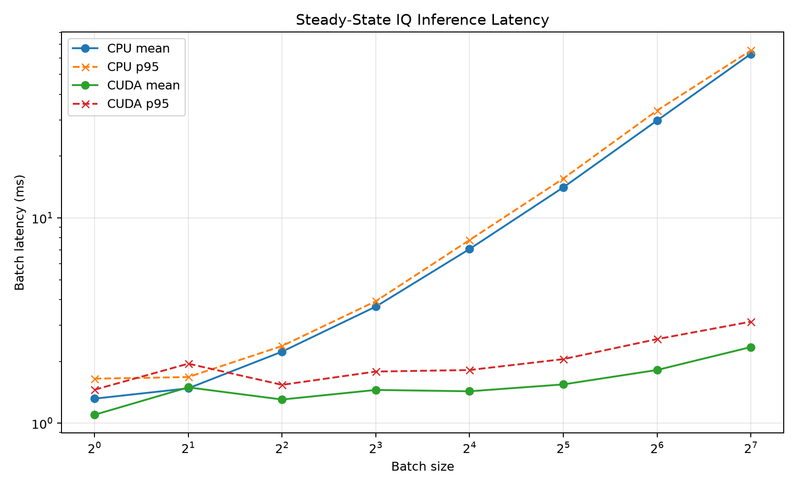
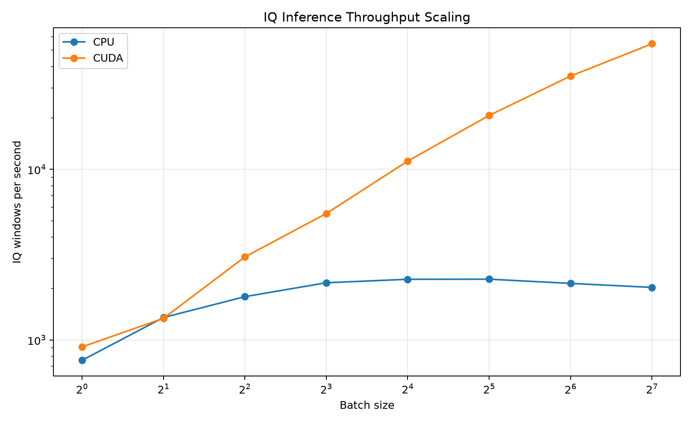
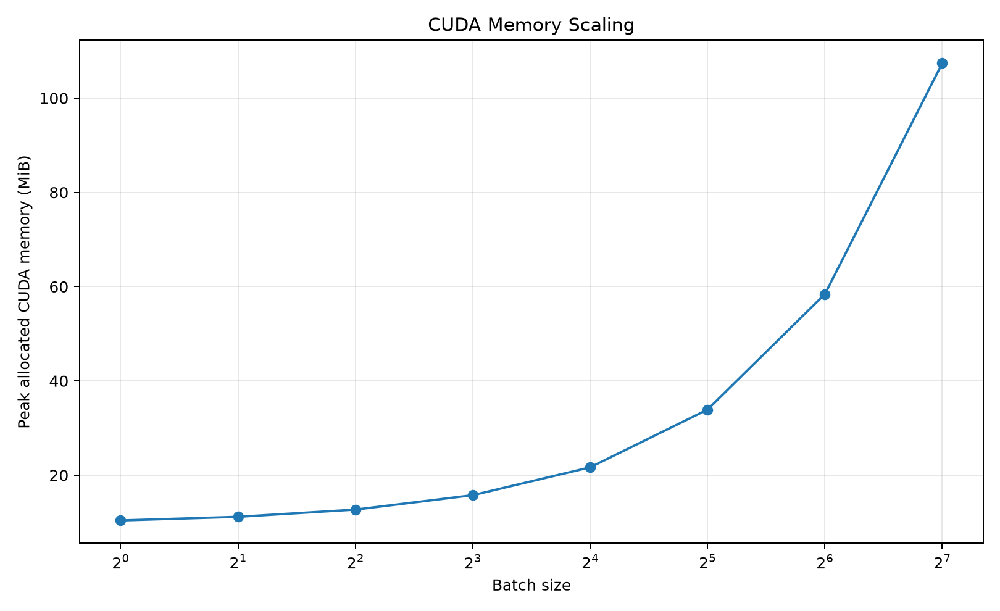

# Deployment and IQ Inference Evaluation v1

## Executive summary

This milestone converts the trained RF modulation-classification models into a reusable deployment stack.

The implementation supports:

- strict checkpoint-backed model reconstruction;
- single-window and batched IQ classification;
- `.npy` and `.npz` IQ input files;
- real two-channel and complex-valued IQ arrays;
- top-k probabilities and machine-readable JSON output;
- long-signal sliding-window inference;
- signal-level probability aggregation;
- fixed-memory streaming inference;
- configurable streaming hop sizes;
- timestamped online predictions;
- CPU and CUDA latency benchmarking;
- throughput and CUDA-memory analysis.

The deployed classifier uses fixed IQ windows containing 2,048 complex samples represented as two real channels.

The main benchmark conclusion is that CPU inference is suitable for low-volume, low-latency requests, while CUDA provides substantial advantages when requests can be batched. CUDA reaches 54,501.9 IQ windows per second at batch size 128, compared with 2,031.9 windows per second on CPU at the same batch size.

CUDA deployment should use a persistent process. Although steady-state inference is fast, the first CUDA inference requires approximately 185 to 225 milliseconds because it includes one-time runtime and kernel initialization.

## Deployment architecture

### Checkpoint-backed inference engine

The deployment engine reconstructs the model directly from checkpoint metadata.

The checkpoint contract includes:

- model configuration;
- model state dictionary;
- ordered class names;
- experiment metadata;
- training seed;
- best validation epoch;
- best validation accuracy;
- initialization metadata.

Checkpoint loading uses strict state-dictionary validation. Incompatible or incomplete checkpoints are rejected rather than partially loaded.

The API supports:

```python
from rfsil.deployment import IQInferenceEngine

engine = IQInferenceEngine.from_checkpoint(
    checkpoint_path,
    device="auto",
    expected_sample_count=2048,
)

prediction = engine.predict_window(iq)
```

Returned prediction data include:

- predicted class index;
- predicted class label;
- confidence;
- raw logits;
- complete class-probability vector.

### IQ file loading

The deployment loader supports:

- `.npy` files;
- `.npz` files;
- complex arrays with shape `[samples]`;
- complex batches with shape `[batch, samples]`;
- real arrays with shape `[2, samples]`;
- real batches with shape `[batch, 2, samples]`;
- optional labels and SNR metadata;
- selection of one sample from a dataset file.

All inputs are converted to contiguous `float32` tensors with shape:

```text
[batch, 2, samples]
```

The loader rejects:

- unsupported layouts;
- empty signals;
- non-numeric inputs;
- NaN and infinite values;
- incorrect channel counts;
- unexpected sample counts;
- inconsistent metadata lengths.

## Fixed-window prediction CLI

The fixed-window command-line interface classifies one or more complete IQ windows:

```powershell
python scripts\predict_iq.py `
  --checkpoint path\to\best_model.pt `
  --input path\to\input.npz `
  --sample-index 0 `
  --device auto `
  --expected-samples 2048 `
  --top-k 4 `
  --output results\prediction.json
```

The JSON output contains:

- checkpoint and device information;
- input-file metadata;
- original dataset index;
- predicted class;
- confidence;
- logits;
- probabilities;
- ranked top-k classes;
- true label and correctness when available;
- SNR metadata when available.

## Long-signal inference

Signals longer than one model window are processed using configurable sliding windows.

Supported options include:

- configurable window size;
- configurable stride;
- overlapping windows;
- bounded inference batches;
- trailing-sample dropping;
- zero or constant padding;
- exact-length enforcement;
- valid-sample-weighted probability aggregation.

Example:

```powershell
python scripts\predict_long_iq.py `
  --checkpoint path\to\best_model.pt `
  --input path\to\long_signal.npy `
  --device auto `
  --window-size 2048 `
  --stride 1024 `
  --remainder pad `
  --batch-size 32 `
  --top-k 4 `
  --output results\long_prediction.json
```

The output includes both per-window predictions and one aggregate signal-level prediction.

## Streaming inference

The streaming implementation uses a fixed-memory overlapping buffer.

It accepts arbitrarily sized incoming chunks while producing windows that are independent of chunk boundaries.

Features include:

- configurable window size;
- configurable hop size;
- overlap support;
- absolute sample positions;
- sequence numbers;
- optional sample-rate timestamps;
- bounded batch inference;
- deterministic reset behavior.

Example:

```python
from rfsil.deployment import (
    IQInferenceEngine,
    StreamingIQClassifier,
)

engine = IQInferenceEngine.from_checkpoint(
    checkpoint_path,
    device="cuda",
    expected_sample_count=2048,
)

classifier = StreamingIQClassifier(
    engine=engine,
    hop_size=1024,
    sample_rate_hz=1_000_000,
)

events = classifier.push(iq_chunk)
```

Each event includes:

- sequence index;
- start and stop samples;
- start, center, and end timestamps;
- predicted label;
- confidence;
- logits;
- probability vector.

A file-backed streaming simulation is available through:

```powershell
python scripts\stream_iq.py `
  --checkpoint path\to\best_model.pt `
  --input path\to\long_signal.npy `
  --window-size 2048 `
  --hop-size 1024 `
  --chunk-size 256 `
  --sample-rate-hz 1000000 `
  --device auto `
  --output results\stream_predictions.json
```

## Benchmark protocol

### Selected checkpoint

The benchmark uses the validation-selected full-label random-initialization system:

```text
Label fraction: 100%
Initialization: random
Seed: 2026
Input channels: 2
Window size: 2,048 samples
Classes: BPSK, QPSK, 8PSK, 16QAM
```

### Hardware and software

The benchmark was executed on the local development workstation:

- Operating system: Windows
- CPU: AMD Ryzen 7 5800X
- GPU: NVIDIA GeForce RTX 4080 SUPER
- System memory: 64 GB
- Python: 3.12.6
- PyTorch: 2.11.0+cu128
- CUDA runtime reported by PyTorch: 12.8

### Benchmark cases

The evaluated batch sizes are:

```text
1, 2, 4, 8, 16, 32, 64, 128
```

Both CPU and CUDA are tested, producing 16 benchmark cases.

Each case runs in a fresh Python process. This prevents a previous case from hiding checkpoint-loading or CUDA-initialization costs.

Each case uses:

- 30 warm-up iterations;
- 200 measured iterations;
- device synchronization around timed CUDA calls;
- identical IQ windows;
- checkpoint reconstruction before measurement.

### Metrics

The benchmark records:

- checkpoint and model loading time;
- first-inference latency;
- steady-state mean latency;
- steady-state p95 latency;
- throughput in IQ windows per second;
- peak CUDA memory allocated by PyTorch.

Peak allocated CUDA memory does not include all driver, runtime, reserved-cache, or display-memory overhead.

## Benchmark results

| Device | Batch | Load ms | First ms | Mean ms | P95 ms | Windows/s | CUDA MiB |
|---|---:|---:|---:|---:|---:|---:|---:|
| CPU | 1 | 7.14 | 4.89 | 1.32 | 1.65 | 759.6 | — |
| CPU | 2 | 7.09 | 5.61 | 1.48 | 1.68 | 1,352.9 | — |
| CPU | 4 | 7.87 | 6.77 | 2.23 | 2.38 | 1,793.4 | — |
| CPU | 8 | 7.26 | 7.41 | 3.70 | 3.93 | 2,163.7 | — |
| CPU | 16 | 7.90 | 12.14 | 7.06 | 7.81 | 2,267.7 | — |
| CPU | 32 | 7.25 | 17.89 | 14.09 | 15.56 | **2,270.7** | — |
| CPU | 64 | 7.31 | 33.89 | 29.83 | 33.38 | 2,145.3 | — |
| CPU | 128 | 7.17 | 67.07 | 62.99 | 65.50 | 2,031.9 | — |
| CUDA | 1 | 35.73 | 219.16 | 1.10 | 1.45 | 910.5 | 10.4 |
| CUDA | 2 | 42.01 | 224.64 | 1.49 | 1.95 | 1,338.3 | 11.2 |
| CUDA | 4 | 35.11 | 184.67 | 1.30 | 1.54 | 3,068.1 | 12.7 |
| CUDA | 8 | 30.59 | 190.61 | 1.45 | 1.78 | 5,510.8 | 15.8 |
| CUDA | 16 | 35.07 | 192.05 | 1.43 | 1.82 | 11,189.9 | 21.7 |
| CUDA | 32 | 33.55 | 215.91 | 1.54 | 2.05 | 20,715.3 | 33.9 |
| CUDA | 64 | 32.66 | 216.48 | 1.82 | 2.57 | 35,242.0 | 58.4 |
| CUDA | 128 | 32.97 | 213.00 | 2.35 | 3.12 | **54,501.9** | 107.4 |

## Latency analysis



CPU mean latency increases approximately proportionally after batch size 8. Batch size 1 requires 1.32 milliseconds, while batch size 128 requires 62.99 milliseconds.

CUDA batch latency remains nearly constant across small and medium batches:

- batch 1: 1.10 ms;
- batch 8: 1.45 ms;
- batch 32: 1.54 ms;
- batch 128: 2.35 ms.

The CUDA p95 result remains below 3.2 milliseconds for every tested batch size.

For interactive single-request inference, CPU and CUDA have similar steady-state latency. CPU may be operationally preferable when avoiding GPU initialization is more important than maximum throughput.

## Throughput analysis



CPU throughput rises until batch size 32 and then declines:

```text
Peak CPU throughput:
2,270.7 windows/s at batch size 32
```

CUDA throughput continues scaling through the largest tested batch:

```text
Peak CUDA throughput:
54,501.9 windows/s at batch size 128
```

CUDA throughput relative to CPU:

| Batch | CUDA speedup |
|---:|---:|
| 1 | 1.20x |
| 2 | 0.99x |
| 4 | 1.71x |
| 8 | 2.55x |
| 16 | 4.93x |
| 32 | 9.12x |
| 64 | 16.43x |
| 128 | 26.82x |

At batch size 2, CPU and CUDA are effectively tied. CUDA becomes clearly advantageous from batch size 4 and increasingly effective as the batch grows.

## CUDA memory analysis



Peak PyTorch-allocated CUDA memory increases with batch size:

| Batch | Peak memory |
|---:|---:|
| 1 | 10.4 MiB |
| 2 | 11.2 MiB |
| 4 | 12.7 MiB |
| 8 | 15.8 MiB |
| 16 | 21.7 MiB |
| 32 | 33.9 MiB |
| 64 | 58.4 MiB |
| 128 | 107.4 MiB |

The measured model remains lightweight relative to the available GPU memory. Batch size 128 requires only approximately 107 MiB of peak allocated CUDA memory under this inference protocol.

## Cold-start behavior

Model loading is inexpensive on CPU:

```text
Approximately 7–8 ms
```

Moving and preparing the model on CUDA requires:

```text
Approximately 31–42 ms
```

The first CUDA inference is much slower than steady state:

```text
Approximately 185–225 ms
```

This first-call cost includes CUDA context and kernel initialization. The cost is not repeated during steady-state inference.

Recommended deployment behavior:

- load the checkpoint once;
- keep the process alive;
- perform one or more warm-up calls during service startup;
- reuse the same inference engine;
- batch independent windows when throughput matters.

Launching a new Python process for every prediction would discard most of the CUDA performance advantage.

## Deployment recommendations

### Low-volume interactive inference

Recommended configuration:

```text
Device: CPU or already-warm CUDA
Batch size: 1
```

CPU avoids CUDA startup overhead and still provides approximately 1.32 ms steady-state latency.

### Real-time streaming

Recommended configuration:

```text
Device: CPU for one low-rate stream
Device: CUDA for multiple concurrent streams
Persistent process: required for best CUDA performance
```

The streaming buffer should use the deployment-specific latency requirement to select the hop size.

At a 1 MHz sample rate:

```text
2,048-sample window = 2.048 ms of signal
1,024-sample hop    = 1.024 ms between predictions
```

### Offline dataset processing

Recommended configuration:

```text
Device: CUDA
Batch size: 64 or 128
```

Batch size 128 provides the highest measured throughput while using only 107.4 MiB of peak allocated CUDA memory.

### Service deployment

A production inference service should:

1. start one persistent process;
2. load the checkpoint during startup;
3. run CUDA warm-up inference;
4. validate incoming IQ shapes;
5. collect requests into short-lived batches;
6. enforce a maximum queue delay;
7. return JSON confidence outputs;
8. monitor latency and memory continuously.

## Limitations

1. Measurements were collected on one workstation.
2. The results are specific to the selected checkpoint and 2,048-sample input window.
3. CPU results depend on operating-system scheduling and background activity.
4. CUDA results depend on the installed driver and PyTorch build.
5. Peak allocated CUDA memory excludes some runtime and reserved-memory overhead.
6. The benchmark uses repeated preloaded IQ windows and does not include file-reading time.
7. JSON serialization time is not included in model inference latency.
8. Streaming acquisition-device latency is not measured.
9. The benchmark does not yet include ONNX, TensorRT, quantization, or mixed-precision inference.
10. The measurements are engineering benchmarks and should not be interpreted as hardware-independent guarantees.

## Reproduction

Run fixed-window inference:

```powershell
python scripts\predict_iq.py `
  --checkpoint path\to\best_model.pt `
  --input path\to\input.npz `
  --sample-index 0 `
  --device auto `
  --expected-samples 2048 `
  --top-k 4
```

Run long-signal inference:

```powershell
python scripts\predict_long_iq.py `
  --checkpoint path\to\best_model.pt `
  --input path\to\long_signal.npy `
  --device auto `
  --window-size 2048 `
  --stride 1024 `
  --remainder pad
```

Run streaming simulation:

```powershell
python scripts\stream_iq.py `
  --checkpoint path\to\best_model.pt `
  --input path\to\long_signal.npy `
  --window-size 2048 `
  --hop-size 1024 `
  --chunk-size 256 `
  --sample-rate-hz 1000000 `
  --device auto
```

Run one benchmark case:

```powershell
python scripts\benchmark_inference.py `
  --checkpoint path\to\best_model.pt `
  --input data\processed\rf_modulation_baseline_v1\test.npz `
  --device cuda `
  --batch-size 128 `
  --expected-samples 2048 `
  --warmup-iterations 30 `
  --measurement-iterations 200
```

Analyze benchmark cases:

```powershell
python scripts\analyze_deployment_benchmark.py `
  --input-directory results\deployment_benchmark_v1\full_cases
```

Run quality checks:

```powershell
python -m ruff check src tests scripts
python -m pytest -W error
```

At completion of this milestone, the repository contains 723 passing automated tests.

## Conclusion

The project now contains a complete path from trained RF checkpoint to deployable IQ inference.

CPU inference is already fast enough for individual requests and low-rate streams. CUDA is most valuable when independent windows can be batched, reaching more than 54,000 windows per second and approximately 26.8 times the CPU throughput at batch size 128.

The combination of strict checkpoint validation, flexible IQ loading, fixed-window prediction, long-signal aggregation, streaming inference, JSON outputs, and reproducible benchmarking provides a practical foundation for integrating the classifier into real RF-processing systems.
